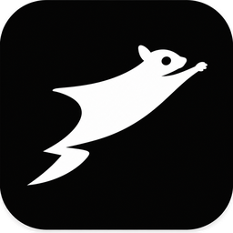

# Musasabi OS

Musasabi OS は、AIが人の代わりに仕事を理解し自律的に実行する Windows AI社員
プラットフォームである。現在の最優先目標は **Epic β-001「営業部運用版完成」** 。

設計ドキュメントは以下の優先順位で参照する(詳細は
[docs/ARCHITECTURE.md](docs/ARCHITECTURE.md) 第0章)。

1. [docs/COMPANY_GENOME.md](docs/COMPANY_GENOME.md) — Mission/Vision/Values/行動原則
2. [docs/DEVELOPMENT_BIBLE.md](docs/DEVELOPMENT_BIBLE.md) — 開発の絶対ルール
3. [docs/ORGANIZATION_BIBLE.md](docs/ORGANIZATION_BIBLE.md) — 組織構造(8本部)
4. [docs/AI_EMPLOYEE_BIBLE.md](docs/AI_EMPLOYEE_BIBLE.md) — AI社員個々の定義
5. [docs/department-playbooks/](docs/department-playbooks/) — 部門別運用書
6. [docs/SECURITY_BIBLE.md](docs/SECURITY_BIBLE.md) — セキュリティルール
7. [docs/PLUGIN_SDK_BIBLE.md](docs/PLUGIN_SDK_BIBLE.md) — プラグイン拡張仕様

システム設計・実装ロードマップへの落とし込みは
[docs/ARCHITECTURE.md](docs/ARCHITECTURE.md) を参照する。

## 現在のステータス: Epic β-001 優先タスク1〜7 実装済み(実機検証待ち)

このリポジトリは、Issue open をトリガーに `main_app.py` / `spec.md` をAIが
上書き生成し続ける自動ループ(旧`.github/workflows/ai-pipeline.yml`)により、
長期間「完了済み」を名乗るコミットが積まれていましたが実体が無い状態でした
(経緯は [docs/ARCHITECTURE.md](docs/ARCHITECTURE.md) 第6章)。ワークフローを
無効化し、以下の7項目をモノレポ構成でゼロから実装・単体テスト・相互配線しました。

1. Windows デスクトップアプリ化 (`apps/desktop`) — Electron、トレイ常駐、自動起動
2. MUSA 常駐アバター (`packages/avatar-2d`) — 状態機械 + オーバーレイウィンドウ
3. Sales Workspace β 版仕上げ (`apps/sales-workspace`) — React + Vite UI
4. FileMaker連携 (`packages/integrations/filemaker`) — Real/Mockアダプタ
5. Zoom Phone連携 (`packages/integrations/zoom-phone`) — Real/Mockアダプタ
6. Voice Analysis (`packages/voice-analysis`) — 感情分析・キーワード検知・通話サマリ
7. Voice Engine (`packages/voice-engine`) — TTS/STTプラガブルプロバイダ

**未検証・既知のギャップ**(`apps/desktop/README.md` 参照):
実際のWindows起動・インストーラビルドはこの開発コンテナのegressポリシー上
Electronバイナリを取得できず未実施。実FileMaker/Zoom Phone/VOICEVOX/whisper.cpp
サーバーへの接続も同様に未検証。Voice EngineのSTT出力とVoice Analysisの入力を
繋ぐ話者分離(ダイアライゼーション)は未実装。3Dアバター(`packages/avatar-3d`)は
このEpicのスコープ外(β版完成後の拡張)。

## リポジトリ構成

```
apps/
  desktop/            Desktop Application(Tauri、Windowsインストーラ、トレイ常駐)
  sales-workspace/    Sales Workspace β 版 UI(React + Vite)
packages/
  avatar-2d/          MUSA 常駐アバター(2D オーバーレイ、状態機械)
  avatar-3d/          3D アバター(ロジック層+three.js/VRM実レンダラーはapps側)
  voice-engine/       TTS / STT(発話合成・音声認識)
  voice-analysis/     通話音声解析(感情分析・キーワード抽出・SQLite永続化)
  ai-core/            AI Sales Employee ロジック(リード優先順位付け・日次計画・KPI)
  ai-company/         AI Company System(組織階層・AI社員モデル・Genome・承認フロー)
  call-training/      コール三段階運用(Learning/Test/AutoCall、Mock架電、共通ナレッジ)
  integrations/       外部サービス連携(FileMaker、Zoom Phone)
  connectors/         Phase 3 コネクタ・フレームワーク(GitHub/Excel/カレンダー/Zoom Phone/FileMaker/会計。Mock・本番未承認・承認ゲート)
  ai-pm/              Phase 4 AI PM(改善提案の優先順位付け・実行キュー・レビューゲート・経営サマリー)
  tenancy/            Phase 5 マルチテナント/プラン/機能ゲート(Free/Pro/Enterprise、使用量・上限、Mock課金)
  ops-monitor/        Phase 6 運用監視(SLO評価・インシデント・復旧ランブック)
  evolution/          Phase 7 自己進化(改善提案の自動生成・ドラフトIssue・ナレッジ品質スコア)
  governance/         AI経営ガバナンス(AI経営陣8役職・月次予算/KPI・着地予測・リスク・是正提案・承認ゲート)
  audit/              AI監査・リスクガバナンス(独立監査・異常/ポリシー違反/KPI整合性/承認遵守検知・部門リスクスコア・一時停止提案)
  advanced-modules/   アドバンスドモジュール12種(Musasabi DNA/Company Brain 2.0/COO指令室/意思決定支援/営業コーチング等。Mockパネル+サービススタブ)
  ecosystem/          Phase 8 AIエコシステム(部門/AI社員/ワークフローのテンプレート・内部マーケットプレイス・安定拡張API)
  agi/                Phase 11 Musasabi AGI(自己最適化/ワークフロー/部門・AI社員新設提案・Company Brain進化・戦略立案。承認/監査/憲章下)
  next-core-modules/  Musasabiコアモジュール12種(AI Constitution/Mission Control/Situation Room/Digital Twin/Relationship Graph/Memory/Customer Brain/QA/Security/Cost/Competitor/Innovation。Mock)
  ceo-dashboard/      CEO二層ダッシュボード(経営メーター・アラート優先度・タイムライン・CEO提案ボックス・AI社員ランキング。Layer B補助データ)
  business-factory/   AI事業ファクトリー(標準テンプレート/業種テンプレートカタログ8種で新規事業ユニット立ち上げ・自動プロビジョニング。MEISHI-TUBE/SaaS/営業代行/出版/コールセンター/EC/飲食店/コンサル。Mock)
  evolution-modules/  進化モジュール12種(Operating Manual/Skill Marketplace/Sandbox/Incident Center/Meeting Room/Simulation/Recruiting/Upgrade Manager/Health Center/Memory Timeline/Command Console/Builder Dept。Company Brain・DNA・ガバナンス・監査・経営DB統合。Mock)
  musasabi-world/     Musasabi World(1つの事業アイデア/テンプレートから AI会社ワークスペースを生成。AI CEO体制・役員・部門・AI社員・KPI・ワークフロー・DNA・Knowledge Vault・レポート・監査・運用データ。business-factory依存。Mock)
  production-roadmap/ 本番ロードマップ(Mock完成追跡14スコープ+Production Readiness 11項目のゲート管理。各項目に設計方針(design)を保持し設計のみ用意=実装は承認後。人間承認まで本番項目はロック。追跡・可視化のみ。Mock。設計書 docs/ai-handoff/PRODUCTION_READINESS_DESIGN.md・構成テンプレート docs/production-readiness/)
  mission-control/    Mission Control 司令室(AI CEO/AI PM/部署一覧/Today's Tasks/Approval/GitHub状況/AI Timeline/System Status のダミーデータ。後からGitHub等へ差し替え可能なオブジェクト設計。Mock)
  ai-secretary/       AI役員秘書/参謀(統一カード9カテゴリ・デイリーブリーフィング・フィルタ・Mockアクション)+市場調査レポート(標準形式・機会スコア・競合比較)+マーケSNS投稿ワークフロー(テキストロック/繰り返し/頻度/添付/承認/Mock予約・本番投稿はロック)。Mock)
  ai-model-registry/  AI統合センター/モデルレジストリ(9プロバイダ・能力スコア14軸・タスク別ルーティング・モデル比較・アップグレード評価・AI秘書通知・Company Brain利用ナレッジ・Secret Centerルール。APIキー非保持=参照名のみ。本番接続は承認までロック。Mock)
  marketing-pdca/     マーケティングPDCAエンジン(投稿タイトル単位管理・数値分析12指標・PDCA・バージョン管理・Company Brainナレッジ化・AI秘書統一カード。テキストロック時は解析のみ。実SNS接続/本番投稿なし。Mock)
  intelligence-layer/ Musasabi Intelligence Layer(AI Policy Engine 13カテゴリ/優先度6段・Knowledge Graph 14種ノード・Workflow Composer 13種ノード+例示フロー・Explainability Center 13項目+スコア5軸。AI秘書/AI監査/CEO/Company Brain統合。実強制は承認までロック。Mock)
  agent-runtime/      エージェント実行ループ(計画→行動→承認→観察→報告。頭脳=無料ローカルLLM(Ollama互換API)自動検出+ルールベースフォールバック。ポリシー検証・人間承認ゲート・監査ログ・Company Brain書き込み・maxStepsガード。ツールは全ローカル・外部送信なし)
  brain-rag/          Company Brain 意味検索+RAG(Ollama埋め込み nomic-embed-text 自動検出+決定論ハッシュ埋め込みフォールバック・コサイン類似ベクトル索引・増分索引・完全ローカル)
  memory/             Brain Memory Engine(未実装、Epic β-001完了後)
  vision/             Vision Engine(未実装、Epic β-001完了後)
  automation/         Automation Engine(未実装、Epic β-001完了後)
  self-improvement/   Self Improvement Engine(未実装、Epic β-001完了後)
  shared/             IPC プロトコル・型定義・共通ユーティリティ
docs/
  COMPANY_GENOME.md       Mission/Vision/Values/行動原則
  DEVELOPMENT_BIBLE.md    開発の絶対ルール
  ORGANIZATION_BIBLE.md   組織構造(8本部)
  AI_EMPLOYEE_BIBLE.md    AI社員個々の定義
  department-playbooks/  部門別運用書
  SECURITY_BIBLE.md       セキュリティルール
  PLUGIN_SDK_BIBLE.md     プラグイン拡張仕様
  ARCHITECTURE.md         システム設計・実装ロードマップ
tests/                横断的な統合・E2Eテスト(現状は各パッケージ内の単体テストのみ)
scripts/              ビルド・リリース・開発補助スクリプト
config/               環境別設定
plugins/              Plugin SDK 準拠のプラグイン
```

## 外部連携コネクタ(Phase 3・D-20260708-004)

外部業務システム連携の「コネクタ・フレームワーク」を `packages/connectors` に用意しています。
ビジネスロジックと連携実装を分離し、**まず Mock アダプタで動作**します。

- 対象: GitHub / Microsoft Office・Excel / カレンダー / Zoom Phone / FileMaker / 会計ソフト
- **すべて Mock モード**。本番接続は**明示承認まで無効**(`productionApproved=false`)
- **読み取りを書き込みより先に実装**。本番書き込みは**承認ゲート(承認者・理由)必須**
- 全操作を**監査ログ**へ記録。**secrets はリポジトリに保存しない**(実接続時に実行環境から注入)
- UI: 管理画面サイドバー「外部連携コネクタ」で一覧・Mock 操作デモ・監査ログを確認可能

実接続(本番アダプタ)は、承認・権限・ログ整備が完了し、ユーザーが明示的に有効化するまで行いません。

## セットアップ

```
npm install
npm run build   # 全パッケージをビルド(依存順に自動でビルドされる)
npm test        # 全パッケージのユニットテスト
```

## ローカルLLM(無料)セットアップ — エージェント頭脳

Musasabi のエージェント実行ループ(エージェント実行センター/アシスタントチャット)は、
**無料のローカルLLM(Ollama)** を自動検出して頭脳として使う。APIキー不要・課金なし・
推論は端末内で完結(データの外部送信なし)。**未検出でもルールベース頭脳で同じループが動く**
ため、インストールは任意。

1. https://ollama.com から Ollama をインストール(無料・Windows/Mac/Linux)
2. モデルを取得: `ollama pull qwen2.5:0.5b`(軽量。性能重視なら `qwen2.5:7b` など)
   - 意味検索/RAG も使うなら: `ollama pull nomic-embed-text`(無料・約270MB。未取得でもハッシュ埋め込みで動作)
3. Musasabi を起動 → **Workflow → エージェント実行センター** が `http://127.0.0.1:11434`
   を自動検出(🧠表示)。URL/モデル名は同画面で変更・接続テストできる

トラブルシューティング:
- デスクトップ版(Tauri)は Rust 経由のネイティブHTTPで接続するため **CORS 設定は不要**
  (接続先は capabilities で 127.0.0.1:11434 / localhost:11434 に制限)
- ブラウザ(`npm run preview:web` など)から使う場合に ⚙️(未検出)のままなら、
  環境変数 `OLLAMA_ORIGINS=*` を設定して Ollama を再起動する
- モデル未取得だと接続はできても応答が失敗する。`ollama list` で取得済みモデルを確認し、
  画面のモデル名を合わせる(既定: `qwen2.5:0.5b`)

エージェントの各行動は Intelligence Layer のポリシー検証を通過し、実外部変更・課金を伴う
行動は遮断される。承認ノードでは人間承認まで停止し、実行は監査ログと Company Brain に残る。

## 無課金の本番機能(実装済み・すべて任意)

| 機能 | 状態 | 必要なもの |
|---|---|---|
| ローカルLLM頭脳(エージェント/チャット) | 実装済み | Ollama(無料)+ `qwen2.5:0.5b` |
| Company Brain 意味検索+RAG | 実装済み | `ollama pull nomic-embed-text`(未取得でも動作) |
| エージェント定例実行(スケジューラ) | 実装済み | なし(アプリ起動中に自動実行) |
| 報告の実ファイル保存(Markdown) | 実装済み | なし |
| 音声読み上げ(TTS) | 実装済み | なし(Windows内蔵音声) |
| 画像OCR(日本語+英語) | 実装済み | なし(エンジン同梱・オフライン) |
| Discord/Slack 完了通知 | 実装済み(オプトイン) | 自分の Webhook URL(無料) |
| GitHub 実データ(Mission Control) | 実装済み(オプトイン) | Fine-grained PAT(読み取り専用推奨) |

Webhook URL・トークンは端末内(localStorage)のみに保存され、未設定なら外部送信は一切発生しない。
メール送信・カレンダー連携は認証情報の保管設計の確定後に追加予定。

## ステージング/Mock デプロイ(STAGING-001)

安全な Mock/ステージング配備の計画・手順・ロールバックは
[docs/STAGING_DEPLOYMENT.md](docs/STAGING_DEPLOYMENT.md) を参照。

- Web プレビュー: `npm run build` → `npm run preview:web`(http://localhost:4173)
- Windows: Actions → Beta Build → Run workflow(main)→ `musasabi-beta-windows-<sha>` artifact
- 直近検証(2026-07-10): build ✅ / テスト 544件 pass ✅ / 秘密情報スキャン ✅(lint は各パッケージ未定義=後続タスク)
- **本番デプロイは行わない**(Production Readiness 4ゲートすべて無効のまま。人間承認後に別途)

## β版評価ビルドの起動手順(D-20260706-002)

β版は Mock 構成で安全に操作できる評価ビルドである。**実API接続・実認証情報の保存・
実架電は一切行わない**(FileMaker / Zoom Phone / VOICEVOX / whisper.cpp は Mock
または「準備中」表示。AutoCall 本番実行は無効)。

### 1. Tauri デスクトップとして起動(Windows 推奨)

前提: Node.js 22+、Rust ツールチェイン、WebView2 ランタイム
(<https://tauri.app/start/prerequisites/> 参照)。

```
npm install
npm run dev:desktop     # フロントをビルドして Tauri ウィンドウで起動
```

Windows インストーラ(NSIS `.exe` / MSI `.msi`)の作成:

```
npm run build:desktop    # = npm run package:win(tauri build)
```

成果物は `apps/desktop/src-tauri/target/release/bundle/nsis/*.exe` および
`bundle/msi/*.msi` に出力される。

### 3. GitHub Actions でインストーラを取得(ローカルにRust環境が無い場合)

> 実績: 2026-07-06 の [Beta Build 実行](https://github.com/grant-inc0801/Musasabi-OS/actions/runs/28769588852)
> で Windows インストーラの Artifact 生成に成功している。

1. GitHub リポジトリの **Actions → Beta Build** を開き、**Run workflow**(Branch: main)で
   手動実行する(`workflow_dispatch` のみ。自動トリガーは無い。所要 約6〜10分)
2. 完了後、実行結果ページ下部の **Artifacts** から
   `musasabi-beta-windows-<sha>` をダウンロードする(要GitHubログイン。保持期間14日)
3. zip を展開すると NSIS インストーラ `Musasabi OS_0.1.0_x64-setup.exe` と
   MSI `Musasabi OS_0.1.0_x64_en-US.msi` が入っている。どちらか一方を実行して
   インストールする(未署名のため SmartScreen 警告が出た場合は
   「詳細情報」→「実行」を選択)
4. β版として配布する場合は、artifact の内容を確認したうえで GitHub Releases に
   手動でアップロードする(自動公開・署名は行わない)

### アプリアイコン(ブランド)

正式アプリアイコンは **黒背景 × 白塗りムササビ・シルエット**(右上へ滑空・文字なし・
AI表記なし。Issue AV-ICON-001)。ブランドアセット一式は `assets/brand/` に配置する。



- `assets/brand/musasabi-icon-{1024,512,256,128,64,32}.png` / `musasabi-icon.svg` /
  `musasabi-icon.ico` / `musasabi-icon-master.png`
- デスクトップアプリ用の書き出しは `apps/desktop/src-tauri/icons/`(同一デザイン)
- 再生成: `python3 scripts/generate-brand-assets.py`(依存: Pillow)。デスクトップ用は
  `python3 scripts/generate-icon-from-source.py`
- 詳細は [docs/brand-guideline.md](docs/brand-guideline.md) を参照

### 2. ブラウザで起動(Rust 環境が無い場合の代替)

```
npm install
npm run dev:web         # Vite dev server(http://localhost:5173)
```

### β版で操作できる画面

管理画面は Development Bible 第7章 UI Philosophy(Glass / Minimal / Professional /
Dark対応、Windows Nativeフォント・速度優先)に準拠したガラス調ダークテーマ+
部門ツリー型サイドバー構成。サイドバーには**部門名のみ**を表示し、
部門配下のサブ項目(営業部 → KPI / コールトレーニング / Sales Brain)から各詳細ページへ
遷移する(β版はすべてMock値)。

| 画面 | 内容 |
| --- | --- |
| 営業部 > KPI(既定) | 全体KPI・AI社員別KPI(コール結果)をグラフと表で表示し、件数(架電/アポ/成約)と率(アポ率/成約率)を算出(売上表示なし)。日次計画・推奨アクション・リード一覧も表示 |
| 営業部 > コールトレーニング | Learning / Test / AutoCall の三段階+通話解析デモ。Test Mode は Mock 架電を操作可能、Learning Mode では日々の作業内容を手動登録して学習させられる。AutoCall は「準備中・承認待ち」で本番実行不可 |
| 営業部 > Sales Brain | 学習データソース(Mock/準備中)と全AI社員共通トーク改善ナレッジ |
| 出版部 | 成果物一覧・販売数・売上(Mock)の表示 |
| 開発部・サポート部 | 部門詳細ページ(進捗・作業内容。専用機能は後続フェーズ) |
| AI社員管理 | 接続線つき組織図(所属人数バッジ・クリックで名簿絞り込み)+AI社員名簿+Company Genome |
| 設定 | AI社員・音声(Mock)・既定コールモード、外部サービス接続準備状況(ダミー値のみ) |

### 右下常駐アバターとミニパネル(デスクトップ版)

- メインウィンドウを **閉じる(X)/最小化** すると、管理画面は隠れて
  **デスクトップ右下のMUSAアバターだけが常駐** する。常駐時はウィンドウ自体が
  アバターサイズまで縮小され、アバター以外の透明領域は残らない(D-20260706-006)
- **アバターをクリック** するとミニパネルが開閉する(パネル・入力欄・モード切替は
  クリック時のみ表示)。ミニパネルでは
  - 現在のモード表示と Learning / Test / AutoCall の切替
    (オートコールは「承認待ち」表示のみで本番実行不可)
  - チャット欄からAI社員(MUSA)への指示(応答は決定論的なMock)
  - **アバターサイズの調整**: スライダー(48〜160px)。設定は保存され、
    アバターのみの常駐表示にも反映される(スライダー操作中にウィンドウは動かない)
  - モード切替は縦配置で、選択中のモードに緑ランプが点灯する
  - 「メイン管理画面を開く」ボタンでの復帰
- モード切替時などに **吹き出し** で提案・通知(例:「次はTest Modeでロールプレイ
  確認しましょう」「AutoCallは承認待ちです」)が表示される。クリックで閉じる
- アバターは背景バッジのないキャラクター単体表示。ホバーで出る「⠿ 移動」ハンドルを
  ドラッグすると常駐位置を変更できる
- メイン画面はシステムトレイの「開く」からも復帰できる

MUSAアバターは **three.js による3D表示**(Issue #200 実装済み)。既定では
プリミティブ製の3Dムササビ(呼吸・浮遊アニメーション付き)が表示され、
ミニパネルの「VRMアバターを読み込む(VRoid)」から **VRoid Studio 製の
.vrm ファイル** を読み込むと差し替わる(表情は業務ステータスに連動、
まばたき・呼吸の待機モーション対応)。読み込みはローカルファイルのみで
外部送信はしない。WebGLが使えない環境では従来の絵文字表示へフォールバックする。

Windows 実機での確認手順は
[docs/WINDOWS_VERIFICATION_CHECKLIST.md](docs/WINDOWS_VERIFICATION_CHECKLIST.md) を参照。
GitHub Actions の手動実行(`workflow_dispatch`)による評価ビルドは
`.github/workflows/beta-build.yml` を使用する。
