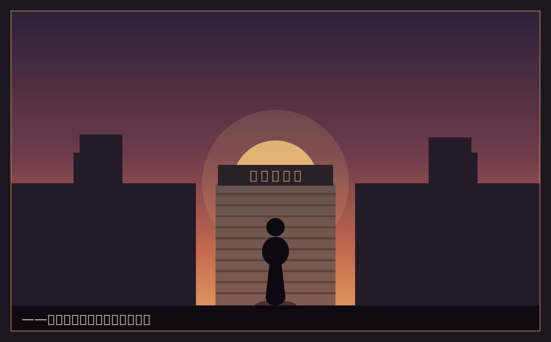

# 序章　シャッターの下りた街

　最後の客が帰ったあと、うちの店にはいつも、乾いた昆布の匂いだけが残った。

　灰谷乾物店。駅前商店街の外れ、角から三軒目。祖父の代からつづく小さな店だ。鰹節、煮干し、乾しいたけ、切り昆布。棚には黄ばんだ値札が並び、そのどれもが、母の丸い字で書かれていた。

「湊、これ、隣の田村さんとこに届けてきて」

　小学生の湊(みなと)は、母から新聞紙にくるんだ煮干しの袋を受け取って、走った。田村のばあちゃんは目が悪くて、字の読める値札より、湊の顔のほうを信用していた。

「あんたんとこの煮干しは、味噌汁が変わるからね」

　そう言って、ばあちゃんはいつも十円多く握らせてくれた。その十円は、湊にとって世界でいちばん重い硬貨だった。

　――値段の裏には、必ず誰かの都合がある。

　父はよくそう言った。原価があって、手間があって、届けるまでの距離がある。安いには安いなりの、高いには高いなりの理由がある。値札はただの数字じゃない。そこには、作った人と、運んだ人と、買う人の、いくつもの都合が折り重なっている。だから、値段を軽く扱う商売人は、いつか客に軽く扱われる――。

　湊は、その言葉が好きだった。

　好きだったのに。

　湊が中学に上がった年、商店街の入口に、四階建ての大型スーパーができた。

　最初の月、母は「うちにはうちの客がいるから」と笑っていた。三か月後、笑わなくなった。半年後、田村のばあちゃんは、スーパーで一袋九十八円の煮干しを買うようになった。安かったのだ。うちの半分の値段で、山ほど入っていた。

「ばあちゃんが悪いんじゃない」

　父は、誰にともなくそう呟いた。母を責めもしなかった。ただ、毎晩、色あせた帳簿を開いて、電卓を叩いていた。カチ、カチ、カチ。答えの出ない計算を、何度も、何度も。

　湊は、その音を布団の中で聞きながら、初めて「経営」という言葉の重さを知った。

　なぜ、うちの煮干しはスーパーに負けたのか。味は負けていなかった。ばあちゃんが証明してくれていた。なのに、負けた。安さに。品揃えに。「ついでに全部買える」という便利さに。

　味がよければ売れる、というのは嘘だった。
　いい物を作れば報われる、というのも嘘だった。

　商売には、味とは別の――もっと冷たくて、もっと大きなルールがあった。そのルールを、うちの誰も知らなかった。父も、母も、祖父も。ただ真面目に、いい物を、丁寧に。それだけを守って、そして潰れた。

　シャッターが下りたのは、湊が中学三年の冬だった。

　最後の日、湊は店の前に立って、下りきったシャッターを見上げていた。灰色の鉄板に、夕日が当たって、少しだけ赤く光った。母は泣いていた。父は泣かなかった。ただ湊の頭に、ごつごつした手を置いて、こう言った。

「湊。お前は、ちゃんと勉強しろ」

「勉強って、何の」

「……なんで店が潰れるのか、だ。俺には分からなかった。最後まで、分からなかった」

　その手は、震えていた。

　――なんで、店は潰れるのか。

　その問いが、灰谷湊という人間の芯に、焼き印のように残った。

　それから二年。湊は、ある学校の名前を知った。

　**星霜(せいそう)経営学園**。

　全寮制。授業料は法外に高い。だがしかし、たった数名だけ、授業料と寮費の全額が免除される「特待生」の枠がある。条件はただ一つ――入学試験で、上位に食い込むこと。

　その学園は、経営者を育てる学校だという。座学ではなく、生徒が実際に金を動かし、事業を興し、競い合う学校。潰れる会社と、生き残る会社を、この目で見られる場所。

　なんで、店は潰れるのか。
　その答えが、あそこにあるかもしれない。

　湊は、母が働きに出たあとのアパートで、擦り切れた参考書にかじりついた。塾に行く金はない。だが、時間だけはあった。誰にも負けたくない、という気持ちだけはあった。

　そして――合格通知が届いた日。

　封筒の中の紙には、こう書かれていた。

『灰谷湊殿　貴殿を特待生として本学園への入学を許可する』

　母は、その紙を両手で持って、また泣いた。今度は、うれしくて泣いていた。

　湊は、泣かなかった。ただ、下りたシャッターの色を思い出していた。あの灰色を。あの、夕日で少しだけ赤く光った灰色を。

　――待ってろ。俺は、あの答えを掴んでくる。

　こうして、貧乏乾物屋の息子は、金持ちだらけの経営学園の門を、たった一人でくぐることになる。

　持ち物は、ボストンバッグ一つと、父の言葉が一つ。

　*値段の裏には、必ず誰かの都合がある。*

　それが、灰谷湊の、たった一つの武器だった。
