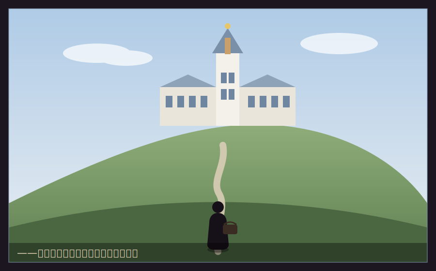

# 第一章　最下層(Fクラス)

　星霜経営学園は、丘の上にあった。

　白亜の校舎、ガラス張りの「経営実践棟」、芝生の中庭には噴水まである。正門の前でタクシーから降りてくる新入生たちは、みんな仕立てのいいコートを着て、革のトランクを引いていた。中には運転手つきの黒塗りの車で乗りつける者もいた。

　湊は、坂の下からそれを見上げていた。バス代を節約して、駅から四十分歩いてきた。汗ばんだ制服の襟を正し、擦り切れたボストンバッグを肩にかけ直す。

　場違いだ、とは思わなかった。
　――ここに、答えがある。それだけだ。

　入学式のあと、新入生は大講堂に集められた。壇上に立った学園長は、白髪の、痩せた老人だった。彼はマイクを使わず、それでいてよく通る声で言った。

「諸君。ようこそ、星霜経営学園へ。まず、諸君に一つ、真実を告げておく」

　ざわめきが、すっと引いた。

「この学園に、平等は存在しない」

　湊は、顔を上げた。

「諸君にはこれから、学園通貨『スター』が配られる。それを元手に会社を興し、事業をし、利益を競ってもらう。半期ごとに、資産と実績で諸君はクラス分けされる。上はS、下はF。上位のクラスには、より多くの資本、より広い寮、より太い人脈が与えられる。下位には――何も与えられない」

　どこかで、息を呑む音がした。

「不公平だと思うか? そうだ。不公平だ。だが、諸君がこれから出ていく世界は、この学園よりもはるかに不公平だ。生まれた家、持っている金、繋がっている人。すべてが最初から違う。その不公平の中で、それでも価値を生み、人を動かし、生き残る――それが経営だ。ここは、その予行演習の場だ」

　学園長は、ゆっくりと講堂を見渡した。老いた目が、一瞬、後方に立つ湊の上で止まった――ような気がした。

「持てる者は、その資本をどう活かすかを学べ。持たざる者は――」

　少しの間。

「――無から、いかにして有を生むかを学べ。それができた者だけが、経営者を名乗る資格を得る。以上だ」

　拍手は、まばらだった。金持ちの子には脅しに聞こえ、そうでない子には死刑宣告に聞こえたからだ。

　湊だけが、心の中で頷いていた。

　――無から、有を。上等だ。うちには、最初から無しかなかった。

　　　　＊

　初期資本の配分は、その日の夕方に発表された。

　全員に一律……ではなかった。入学試験の成績、面接、そして「保証人資産審査」――要するに家がどれだけ金を持っているか――で、スタート地点の持ち星が違った。

　最上位のSクラス初期配属者には、一万スター。
　最下層、湊のいるFクラスには――五百スター。

　二十倍の差が、初日からついていた。

　Fクラスの教室は、校舎のいちばん端、日の当たらない北向きの部屋だった。壁の塗装は剥げ、机は他クラスのお下がり。集められた顔ぶれは、どれも、どこか「はみ出し者」の匂いがした。

「うわー、ここが噂の掃きだめFクラスかー」

　妙に明るい声がした。振り向くと、でかい男が立っていた。身長は百九十近い。柔道でもやっていそうな体格なのに、顔は困った犬みたいに人懐っこい。

「番場剛(ばんば ごう)。よろしくな。俺、特待生の三人のうちの一人。金がなさすぎて逆に清々しいだろ?」

「……灰谷湊。俺も、特待生だ」

「マジか! 仲間じゃん!」

　番場は、湊の手をぶんぶん握った。手が、分厚くて温かかった。

「あたしも特待生でーす!」

　机の上に座って足をぶらぶらさせていた小柄な少女が、手を挙げた。ポテトチップスを片手に、もう片方の手にはノートパソコン。

「桃園ひな(ももぞの ひな)。数字とデータのことなら任せて。あ、灰谷くんだっけ、あんた入試の商学、満点だったでしょ」

「……なんで知ってる」

「掲示、こっそり見た。特待三人の点数。あたしと番場は面接でギリ拾われた口。でも灰谷くんは学科でぶっちぎってた。ねえ、あんた、何者?」

　ひなの目が、きらりと光った。獲物を見つけた猫みたいに。

「乾物屋の息子だ」

「乾物屋?」

「潰れたけどな」

　教室が、少しだけ静かになった。だが湊は、平然と続けた。

「潰れる店を、いちばん近くで見てきた。だから、潰れない店の作り方を知りたい。ここに来たのは、それだけの理由だ」

　番場が、ぽかんと口を開けた。それから、にっと笑った。

「お前、いいな。なんか、いいわ」

　ひなが、パソコンをぱたんと閉じた。

「……面白い。灰谷くん、あんた、あたしらのボスになりなよ」

「ボス?」

「Fクラスは五百スターしかない。一人でやってたら全員野垂れ死に。だったら組んだほうがいい。頭がいるチームには、勝てる目がある」

　湊は、少し考えた。序章で誓った「一人でやる」という覚悟が、初日から揺らいだ。だが――父の店は、家族三人だけでやっていた。人手が足りなくて、仕入れも配達も接客も、全部抱え込んで、そして潰れた。

　――一人でできることには、限りがある。それも、あの店が教えてくれたことだ。

「……分かった。組もう。ただし」

　湊は、二人を見た。

「馴れ合いはしない。俺は、勝ちに来た。付き合えるか?」

　番場とひなは、顔を見合わせて、同時に笑った。

「「望むところ」」

　　　　＊

　その日の放課後、湊は経営実践棟の中庭を歩いていた。噴水の縁に、一人の少女が座っていた。

　銀に近い長い髪。背筋の伸びた立ち姿。制服の胸には、他の誰も付けていない、金色のバッジ――**Sクラス首席**の証。

　白鷺令子(しらさぎ れいこ)。入学式で総代を務めた、財閥・白鷺グループの令嬢。首席入学。初期資本一万スター。この学園の、生まれながらの女王。

　彼女は、タブレットで何かの資料を見ていた。湊が通り過ぎようとしたとき、令子は顔も上げずに言った。

「あなた、Fクラスの特待生でしょう」

　湊は、足を止めた。

「知ってるのか」

「入試の商学、満点。面白い答案だった。特に問四――『この会社が潰れる理由を三つ挙げよ』。あなたの答えだけ、他の受験生と違っていたわ」

　令子は、ようやく顔を上げた。氷のように冷たく、そして息を呑むほど整った顔立ちだった。

「他の子はみんな、財務や戦略の話を書いた。あなただけ、こう書いた。『社長が、値段を軽く扱ったから』と」

「……それが、答えだと思ったからだ」

「詩人ね」令子は、ふっと鼻で笑った。「でも、経営は詩じゃない。数字よ。あなたの実家、乾物屋だったそうね。潰れたのは、あなたの父親が『値段を大切にした』からじゃない。大切にしすぎて、市場の価格に合わせられなかったから。感傷は、赤字の言い訳にはならないわ」

　その言葉は、氷の刃みたいに、湊の古傷を正確に抉った。

　湊は、拳を握った。反論の言葉が喉まで出かかって――呑み込んだ。

　なぜなら、彼女の言葉には、一片の真実があったからだ。

「……そうかもな」

　湊は、静かに言った。

「うちの親父は、値段を大切にしすぎた。市場に合わせられなかった。それは、その通りだ。だから俺は、ここに来た。値段の大切さと、市場の冷たさ。その両方を、ちゃんと分かる経営者になるために」

　令子の眉が、わずかに動いた。予想と違う返しだったのだろう。

「……減らず口ね」

「褒め言葉として受け取っておく」

　湊は、背を向けて歩き出した。令子の視線が、背中に刺さっているのを感じた。

　――白鷺令子。あんたは、俺が越えなきゃいけない壁だ。

　一万スターと、五百スター。
　その差を、湊はまだ、絶望とは思っていなかった。

　*無から、有を。*

　学園長の言葉が、灰色のシャッターと重なって、胸の奥で静かに燃えていた。

　　　　＊

　その夜、湊は、生まれて初めて、実家以外の場所で眠ることになった。

　Fクラスの寮は、校舎と同じで、いちばん古い棟だった。塗装の剥げた廊下。軋む階段。共同の洗面所は、蛇口が三つのうち一つ壊れていた。そして――相部屋。

「よろしくなー、ルームメイト!」

　二段ベッドの下段に、でかい体を放り込んで、番場が手を振った。

「番場が、同室か」

「くじ運だけはいいんだ、俺」番場は、へへ、と笑った。「上、使っていいぞ。俺、寝相わりぃから、上から落ちたら死ぬ」

　六畳ほどの部屋に、二段ベッドと、小さな机が二つ。それだけで、もう、いっぱいだった。荷ほどきといっても、湊の持ち物は、ボストンバッグ一つ。参考書と、着替えと、それだけ。すぐに終わった。

　机の上に、たった一つだけ、私物を置いた。母が持たせてくれた、小さな写真立て。灰谷乾物店の、まだシャッターが開いていた頃の、家族三人の写真。

「それ、実家か?」番場が、覗き込んだ。

「ああ」

「……いい店だな。あったかそうだ」

　湊は、少し、驚いた。潰れた店を「いい店」と言われたのは、初めてだった。

「……ありがとな」

　　　　＊

　問題は、飯だった。

　夕食どき、湊は、食堂の券売機の前で、固まっていた。

　メニューの値段の横に、小さく但し書きがあった。『Fクラスは福利割引の対象外です』。定食は、一食、二十スター。学園通貨のスターは、事業の元手であると同時に――この学園では、生活費そのものでもあった。金持ちの子は、家からいくらでも補充できる。だが、特待生の湊にとって、五百スターがすべてだった。

　三食、まともに食えば、一日六十スター。十日足らずで、事業の元手が、腹の中に消えていく計算だった。

「……飯を食うのも、経営判断か」

　湊は、いちばん安い、素うどん――五スター――のボタンを、押した。

「げっ、灰谷、それだけ?」隣で、大盛りカレーの食券を握った番場が、目を丸くした。「育ち盛りだぞ俺たち!」

「俺は、腹より、元手を減らしたくない」

「……こいつ、初日から、修行僧かよ」

　ずずず、と、湊は、素うどんをすすった。実家のだしとは、比べ物にならない、味の薄い、業務用のつゆ。それでも、温かかった。

　少し離れたテーブルの向こう、ガラス張りの一角では、Sクラスの生徒たちが、白いクロスのかかった席で、湯気の立つコース料理を食べていた。その中に、白鷺令子の、銀色の髪が見えた。彼女は、ナイフとフォークを、静かに、優雅に動かしていた。

　同じ食堂。同じ屋根の下。なのに、まるで、別の国だった。

「……格差、って、こういうことか」番場が、ぽつりと言った。カレーを頬張りながら。

「そうだな」湊は、うどんの器を、両手で包んだ。「でも、番場。あっち側のコース料理も、こっち側の素うどんも、値段の裏には、誰かの都合がある。あの料理を作る奴、運ぶ奴、うどんの粉を挽く奴。……全部、繋がってる。俺は、その繋がりを、いつか、こっちの手で、動かす側になる」

「でっけえな、素うどんすすりながら言うことか、それ」

「うるさい」

　その時、ぬっと、横から手が伸びてきて、湊のうどんの天かすを、つまんで奪った。

「あ、天かす、無料なんだ。ラッキー」

　ひなだった。トレイの上には、白米と、無料のたくあんと、そして――大量の天かす。

「桃園、お前……それ、飯なのか?」番場が、ドン引きした。

「天かす丼。醤油かけたら、実質、天丼。原価ほぼゼロ。あたし、これで三年いける」ひなは、けろりと言った。「特待生の生存戦略、なめないでよね」

　湊は、思わず、噴き出した。番場も、腹を抱えて笑った。

　貧乏で。相部屋で。素うどんと天かす丼で。

　それでも――なぜだろう。実家のシャッターが下りて以来、ずっと張り詰めていた何かが、この夜、ほんの少しだけ、緩んだ気がした。

　金は、なかった。だが、笑える相手は、いた。

　――悪くない。ここでの暮らしも、案外、悪くない。

　窓の外、丘の上の空には、都会では見えなかった星が、いくつも、瞬いていた。
