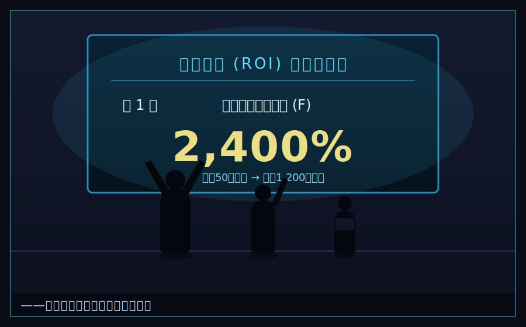

# 第二章　百円の勝負

　入学して、授業が始まった。

　星霜経営学園の一日は、朝のホームルームから始まる。Fクラスの担任は、柏木(かしわぎ)という、三十過ぎの、いつも眠そうな顔をした経営学の講師だった。ネクタイはいつも緩んでいて、やる気があるのかないのか、よく分からない男。だが――彼には、一つだけ、絶対に欠かさない日課があった。

「はい、じゃ、今朝の一問(いちもん)」

　柏木は、黒板に、ぺたりと一問だけ、問題を書く。生徒はそれに、三分で答えを書く。名づけて『今朝の一問』。Fクラスの、朝の小テスト。点数は成績には入らない。だが、柏木は言う。「経営者はな、毎朝、答えのない問いに、答えを出さなきゃならん。その練習だ」と。

　入学四日目の、今朝の一問は、これだった。

『百円の元手で二百円を稼ぐのと、一万円の元手で一万五千円を稼ぐの。優れた経営者は、どちらか。理由も書け』

「かーっ、こんなの決まってんだろ」番場が、鉛筆を握って、自信満々に書きなぐった。「一万五千円のほう! だって、稼いだ額がでけえもん! 五千円 > 百円! な!」

「番場くん、それ、たぶん、落とし穴だよ」隣の席で、ひなが、あっさり書き終えて、あくびをした。「答え、利益率。百円で二百円は、倍。倍率二〇〇%。一万円で一万五千円は、一・五倍。五〇%。効率がいいのは、前者。少ない元手で、大きく増やせる奴のほうが、経営者としては上」

「えっ、額じゃないの!?」

「額を追うのは、金持ちの発想。あたしたちみたいな貧乏人は、率で戦うしかないの」

　湊は、少し違う答えを書いていた。柏木が、それを覗き込んで、片眉を上げた。

「灰谷。お前、なんて書いた」

「『情報が足りないので、決められない』と書きました」湊は言った。「桃園の言う通り、率なら前者です。でも――その百円が、たまたま拾った運なら、次はない。一万円で一万五千円のほうが、仕組みで再現できるなら、そっちが上です。一回の勝負なら率。続けるなら、再現性。どっちを聞かれてるかで、答えが変わります」

　教室が、少し、静かになった。

　柏木は、しばらく湊を見て、それから、ふっと笑った。眠そうな目が、一瞬だけ、覚めた。

「……面白いこと言うな、お前。満点にはしてやらん。設問の意図を外してるからな。だが――」柏木は、チョークを、指で回した。「経営ってのは、たいてい、設問のほうが間違ってる。出された問いを疑える奴だけが、生き残る。覚えとけ」

　湊は、その言葉を、胸の隅に、そっとしまった。

　　　　＊

　二週間は、あっという間だった。

　授業は、思っていたより、面白かった。会計、マーケティング、組織論、交渉術。座学もあれば、実在の企業の倒産事例を、丸一日かけて分解する演習もあった。湊は、いちばん前の席で、乾いたスポンジのように、それを吸い込んだ。潰れた店の答えが、少しずつ、輪郭を持ち始める感覚があった。

　番場は、相変わらず、今朝の一問を、半分も当てられなかった。だが、昼休みになると、いつのまにか他クラスの生徒とも仲良くなっていて、廊下ですれ違うたびに「よう!」と手を挙げられていた。テストの点は最下位でも、顔の広さは、学年一だった。

　ひなは、放課後、ボロいノートパソコンを叩いて、学園の公開データを、片っ端から集めていた。「情報を制する者が、貧乏を制するの」が口癖だった。Sクラスの生徒が最新のタブレットを配られている横で、彼女は、画面の割れたパソコンを、宝物みたいに抱えていた。

　三人は、毎晩のように、寮の談話室に集まった。素うどんと、天かす丼と、たまの贅沢のカップ麺を囲んで、今朝の一問の答え合わせをしたり、他愛のない話をしたり。番場の家の弟妹の話。ひなの、天かす以外の生存レシピ。湊の、実家のだしの取り方。

　――馴れ合いはしない、と初日に言ったのは、どこの誰だったか。

　湊は、時々、そう自分に苦笑した。だが、悪くなかった。誰かと飯を食い、誰かと笑い、誰かと明日の話をする。父の店には、家族しかいなかった。ここには、家族じゃない誰かが、いた。

　そして――そんな、少しだけ地に足のついた日々が、二週間ほど続いた頃。

　最初の課題――「カンパニー・トライアル」が、告げられた。

　その朝、柏木は、今朝の一問を書かなかった。代わりに、黒板に、大きくこう書いた。

『カンパニー・トライアル ―― 開始』

「さて。お楽しみの、初陣だ」柏木は、いつもの眠そうな目で、教室を見渡した。「ルールを説明する。よく聞け。各チームは、配られた初期資本を元手に、今日から学園祭までの一か月間、学園の内でも外でも、好きに事業を興していい。判定は――最終利益額。以上だ」

「先生」誰かが、不満げに手を挙げた。「元手、クラスで全然違うじゃないですか。Sは一万、俺らFは五百。二十倍っすよ。フェアじゃない」

「フェアじゃない。その通りだ」柏木は、あっさり頷いた。「入学式で、学園長が言っただろう。世の中は、最初から不公平だ、と。金のある奴は、金で殴ってくる。それが、現実だ」

　教室が、重い空気になった。だが、柏木は、けだるげに続けた。

「ただ――判定は利益額だが、講評では、それだけを見るわけじゃない。額の裏にある、もう一つの物差し。それに気づいて、使いこなせた奴は……ま、面白いことになる。気づけない奴は、額で殴られて、終わりだ。以上、解散。せいぜい、無から有を、生んでみせろ」

　柏木は、ひらひらと手を振って、教室を出ていった。

　――もう一つの、物差し。

　湊は、その言葉を、胸の隅に、しまった。額じゃない、何か。柏木は、貧乏人にも勝ち筋があると、確かにそう言った。あとは、それが何かを、自分たちで、見つけ出すだけだ。

　　　　＊

「五百スターで、Sクラスの一万スターと戦うのかよ……」

　番場が、頭を抱えた。教室――もといFクラスの片隅に、湊たちのチームは集まっていた。三人。名前は、ひなが勝手に決めた。「チーム・アッシュ」。灰谷の「灰(アッシュ)」から取ったらしい。

「まともに商品を仕入れて売る、じゃ勝てない」湊は、黒板の前で腕を組んだ。「仕入れに金がいる。在庫を抱えれば、売れ残りが赤字になる。金のないチームがやっちゃいけない、いちばん危ない橋だ」

「じゃあどうすんの」ひなが、ポテチをかじりながら言う。

「金をかけずに、価値を生む。在庫を持たずに、需要と供給を繋ぐ。――要するに、俺たちは『物』を売るんじゃない。『場』を売る」

「場?」

　湊は、黒板にチョークを走らせた。

「この学園、金持ちだらけだ。上位クラスは資本が余ってる。だが、時間と手が足りてない。連中は事業を回すのに必死で、細かい雑用に手が回ってない。逆に、下位クラスには何がある?」

「……暇と、労働力」ひなが、目を見開いた。「あっ」

「そうだ。俺たちは、下位クラスの『暇と手』を、上位クラスの『金』に繋ぐ。仲介する。マッチングだ。在庫ゼロ、仕入れゼロ。俺たちが売るのは、手数料をもらう『仕組み』そのものだ」

　番場が、ぽかんとした。

「えっと……つまり、なんだ?」

「便利屋の元締めだよ、番場」ひなが、にやりと笑った。「仕事を頼みたい金持ちと、金が欲しい貧乏人を、あたしらが繋ぐ。繋いだ手数料を取る。天才じゃんこれ、灰谷くん」

「まだ天才じゃない。問題が二つある」湊は、指を二本立てた。「一つ、どうやって上位クラスの需要を掘り起こすか。連中は、自分が何に困ってるかすら気づいてない。二つ、どうやって信用を作るか。得体の知れないFクラスの仲介なんて、誰も使わない」

「一つ目は、あたしがやる」ひなが、パソコンを開いた。「学園の全カンパニーの事業内容、公開されてる。それを全部データ化して、『この事業をやってるなら、絶対この作業で人手が足りてないはず』ってのを予測する。困りごとを、先回りして当てにいく」

「二つ目は、俺だな」番場が、胸を叩いた。「信用ってのは、要するに人だろ。俺、顔を売るのは得意だ。上位クラスの寮、全部あいさつ回りしてくる。飯もおごる。……あ、おごる金は、ない」

「おごらなくていい。番場は、ただ話を聞いてこい」湊が言った。「相手が何に困ってるか。困りごとを聞き出すだけでいい。売り込むな。聞け」

「聞くだけ?」

「困りごとを話した相手は、その解決策を持ってきた奴を信用する。売り込んでくる奴は、警戒される。順番が逆なんだ」

　湊の頭の中には、田村のばあちゃんがいた。うちの煮干しを買ってくれたのは、湊が味噌汁の話を聞いたからだ。売り込んだからじゃない。困りごと――「最近、だしの味が薄くてね」――を、聞いたからだ。

　――値段の裏には、都合がある。都合を知る奴が、勝つ。

「よし。動くぞ。金がない分、俺たちは足で稼ぐ」

　　　　＊

　三日で、ひなのリストができた。

　Sクラスの某チームは、輸入雑貨の物販をやっているが、検品と梱包で手が回っていない。Aクラスの某チームは、学園祭の出店準備で、当日の売り子が足りない。Bクラスの某チームは、SNS運用をやりたいが、投稿画像を作る時間がない――。

　番場が足で確かめてきた「生の声」と、ひなのデータが、恐ろしいほど一致した。

「困りごと、当たってる……全部当たってる」番場が震えた。「ひな、お前、怖いな」

「褒めてる? 褒めてるよね?」

　そして湊は、その困りごとに、Fクラスと下位クラスの「暇な手」を割り当てた。検品したい奴、梱包が得意な奴、当日だけ働きたい奴。学園の掲示板に、たった一枚の紙を貼った。

『チーム・アッシュ　なんでも仲介所――あなたの「面倒」を、誰かの「仕事」に。手数料10%』

　最初の依頼が来たのは、貼ってから二時間後だった。

　　　　＊

　仲介は、面白いように回り始めた。

　中庭の桜はとうに散り、木々が新緑に燃える、四月の終わり。金はかからない。湊たちは需要と供給を繋ぐだけ。繋ぐたびに、取引額の一割が入る。在庫はゼロ、損失リスクもゼロ。スターは、五百から、じわじわと増えていった。六百。七百。八百。

「見ろよ、この右肩上がり!」番場が、ひなの収支表を掲げて、はしゃいだ。「このままいけば、Sクラスだって夢じゃ――」

「番場」湊は、静かに言った。「うまくいってる時ほど、足元を見ろ。うちの店も、スーパーが来る前の月まで、右肩上がりに見えてた」

　その言葉は、三日後、現実になった。

　　　　＊

　五月の連休が明けた朝。ひなが、真っ青な顔で、収支表を突きつけてきた。

「灰谷くん……依頼が、止まった。昨日から、ぱったり」

「なんだと?」

　原因は、すぐに知れた。廊下で、湊を呼び止めた者がいた。

「よう、Fクラスの噂の三人組。灰谷、だろ?」

　爽やかに笑う、見栄えのいい同級生だった。Cクラスの、財前康介。弁が立ち、誰とでもすぐ打ち解ける、人好きのする男。この時は、まだ、ただの親切な同級生だった。

「忠告しといてやる。Bクラスの連中が、お前らの仲介、そっくり真似して始めたぜ」財前は、肩をすくめた。「しかも、手数料五パーセント。お前らの半額だ。資本があるから、赤字覚悟で客を根こそぎ持ってく気だ。……いい商売してたのにな。気の毒に」

　財前は、ひらひらと手を振って、去っていった。妙に、耳に残る男だった。

「……半額」ひなが、呻いた。「勝てないよ、そんなの。あっちは資本で殴ってくる。同じ手数料まで下げたら、うち、利益ゼロ。下げなきゃ、客が全部逃げる。詰みじゃん」

　番場も、肩を落として帰ってきた。「灰谷……昨日まで『よろしくな』って言ってくれてた上位クラスの連中、今日は目も合わせてくれねえ。みんな、安いほうに流れちまった」

　右肩上がりだったグラフが、崖から落ちるように、折れていた。

　　　　＊

　その夜、Fクラスの空き教室。三人は、黙り込んでいた。窓の外は、五月雨(さみだれ)。梅雨のはしりの、冷たい雨が降っていた。

「……値下げして、対抗する?」ひなが、ぽつりと言った。

「しない」湊は、即答した。

「でも、このままじゃ」

「聞け」湊は、二人を見た。「安売り合戦は、資本のある奴が、絶対に勝つ。うちが五パーセントに下げたら、あっちは三パーセントにする。うちが三にしたら、あっちはゼロにする。赤字で殴り合って、体力の続くほうが勝つ。――それは、金持ちの土俵だ。乗った瞬間、俺たちは負ける」

　湊の脳裏に、父の帳簿を叩く音が、蘇っていた。カチ、カチ、カチ。大型スーパーの安さに、値段を下げて対抗しようとして、原価を割り、体力を削り、そして潰れた、あの音が。

「値段で戦っちゃいけない。うちの親父は、それで死んだ」湊は言った。「俺たちが戦うのは、値段じゃない。――『信用』だ」

「信用?」

「考えろ。あのBクラスの真似っ子は、なぜ客を奪えた? 安いからだ。でも、安さだけで集めた客と、安さだけで集めた働き手は――質が、ばらばらだ。誰でも登録できる、誰でも受けられる。その代わり、雑な仕事をする奴も、平気で混ざる。梱包を壊す、当日にすっぽかす、そういう事故が、必ず起きる」

　ひなの目が、覚めてきた。

「あっちが安さで数を追ってる、今この瞬間が、勝負どころだ」湊は、黒板に書いた。『信用を、仕組みにする』。「俺たちは、逆をやる。登録する働き手を、あらかじめ、俺たちが会って、見極める。仕事の後には、依頼主から評価をもらって、記録する。次に頼む人が、その評価を見て、安心して選べる。――『あそこに頼めば、確実だ』。その一点で、勝つ」

「……レビュー付きの、信用の台帳」ひなが、パソコンを引き寄せた。「登録者を先に集めて、実績を貯めて、質を保証する。一回作れば、勝手に回る。あっちが後から真似しようにも、貯まった信用は、コピーできない」

「それが、参入障壁(さんにゅうしょうへき)だ。――後から来た奴が、簡単には割り込めない“堀(ほり)”のことだ」湊は頷いた。「値段は、一晩で真似できる。信用は、一晩じゃ、真似できない」

　番場が、ぬっと、身を乗り出した。

「なら、俺の出番だな」その顔に、いつもの人懐っこい笑みが戻っていた。「もう一回、上位クラス、全部回ってくる。今度は、こう言うんだ。『うちは、安くない。でも、絶対に、事故らない』ってな。安さに釣られて逃げた連中も、一回、痛い目見りゃ、戻ってくる」

　　　　＊

　そこからの数日は、まさに、奔走だった。

　番場は、雨の中を走り回り、一軒一軒、頭を下げて回った。「安さじゃない、確かさで選んでくれ」と。ひなは、三晩徹夜して、評価の貯まる登録システムを組み上げた。湊自身は、いちばん面倒で、いちばん割に合わない――だから真似っ子が嫌がって放り出す――難しい依頼を、自分の手で引き受け、完璧に片付けてみせた。信用は、口で語るものじゃない。一件、一件、事故なくやり遂げて、積み上げるものだった。

　そして、湊の読みは、当たった。

　安さで数を追ったBクラスの真似っ子は、質の悪い働き手を捌ききれず、方々で事故を起こした。壊れた荷物、すっぽかされた当日、怒る依頼主。「安かろう悪かろう」の悪評が、じわじわと広がった。

　一方、チーム・アッシュには、「高くてもいいから、確実な仕事を」という依頼が、戻り始めた。一度、痛い目を見た上位クラスほど、信用の価値を、身に染みて知っていた。

　梅雨が明ける頃には、グラフは、以前よりも高く、跳ね上がっていた。しかも――安売り合戦に一切乗らなかったおかげで、使ったスターは、ほとんど増えていない。利益は伸び、元手は、据え置き。

「……利益率、とんでもないことになってる」ひなが、電卓を見て、呆然と呟いた。「あたしたち、値下げで消耗した分がゼロだから……」

「それでいい」湊は、静かに笑った。「額で殴ってくる相手には、率で勝つ。柏木先生の、今朝の一問の答えだ」

　番場が、しみじみと言った。

「灰谷、お前……たまに、おっさんみたいな顔するよな」

「うるさい」

　　　　＊

　初夏。梅雨も明け、蝉の声が聞こえ始めた、一学期末。学園祭当日。

　カンパニー・トライアルの結果発表は、大講堂で行われた。上位から順に、利益額が読み上げられていく。

　一位は、当然のようにSクラスの白鷺令子のチーム。潤沢な資本で高級輸入菓子を大量に仕入れ、洗練された店舗を出し、圧倒的な売上を叩き出した。利益、八千スター。

　その利益額に、講堂がどよめいた。桁が違う。

「まあ、金がある奴が勝つ。当然だよな」番場が、ため息をついた。

　だが、湊は俯かなかった。じっと、電光掲示板を見ていた。

　――『百円の元手で二百円を稼ぐのと、一万円の元手で一万五千円を稼ぐの、どちらが上か』。

　柏木の、今朝の一問が、頭をよぎった。額を追うのは、金持ちの発想。貧乏人は、率で戦うしかない。ひなの、あの言葉も。

「利益額じゃない。見るべきは、利益率だ」

「利益率?」ひなが首をかしげる。

「白鷺のチームは、いくら元手を使った? 一万スターだ。八千スター儲けても、投じた資本に対する利益率は八割。……俺たちは?」

　ひなが、はっとして電卓を叩いた。

「あたしたち……元手、ほとんど使ってない。仲介だから。使ったのは、掲示物の印刷代とか、雑費で……五十スターくらい。それで、利益は――」

　電光掲示板が、下位クラスの結果を映し出した。

『Fクラス／チーム・アッシュ　利益 千二百スター』

　講堂が、ざわついた。Fクラスが、四桁の利益を出した。それも、たった三人で、初期資本五百スターのうち、ほとんど使わずに。

「利益率……二千四百パーセント」ひなの声が、震えた。「元手五十で、千二百返した。二十四倍……」

　壇上の教員が、マイクを取った。

「補足する。利益額ではFクラス・チーム・アッシュは全体八位。だが――**資本効率(ROI)においては、全チーム中、第一位**である」

　どよめきが、大きくなった。

「彼らは在庫を持たず、リスクを取らず、他者の遊休資源を価値に変えた。少ない資源で最大の価値を生む――これこそ、経営の本質の一つの形だ。学園長が言った『無から有を生む』を、彼らは体現してみせた」

　番場が、湊の肩を、ばんばん叩いた。

「灰谷! 一位だ! 俺たち、一位取ったぞ!」

　ひなは、パソコンを抱えて飛び跳ねていた。

　湊は、電光掲示板の「二千四百パーセント」という数字を、ただ見つめていた。胸の奥が、熱かった。

　――親父。俺、少しだけ、分かった気がする。

　金がなくても、価値は生める。物がなくても、商売はできる。大事なのは、いくら持っているかじゃない。持っているものを、どう活かすかだ。

　ふと、視線を感じて振り向くと、壇上を降りた白鷺令子が、こちらを見ていた。

　その顔に、初めて――ほんのわずかに、興味の色が浮かんでいた。

「……利益率一位、ね」

　令子は、すれ違いざま、湊にだけ聞こえる声で言った。

「感傷家かと思ったら、なかなか冷徹な計算をするじゃない。でも――勘違いしないで。あなたが勝ったのは、誰も本気で潰しに来なかったからよ。Fクラスなんて、眼中になかったから」

　令子は、足を止めなかった。

「次は、そうはいかない。這い上がってくる灰は、踏み消される。それが、この学園のルールよ」

　その背中を、湊は見送った。

「……上等だ」

　湊は、小さく笑った。踏み消される? 灰を舐めるな。灰は、燃え残りだ。まだ、火種が残っている。

　こうして、チーム・アッシュは最下層Fクラスから、初めて学園に名を刻んだ。

　だが、注目されるということは――狙われるということでもあった。

　湊は、まだ知らなかった。這い上がった者に近づいてくる手の中には、握手のふりをした、刃があることを。

---

> ### 📎 柏木のひとくち経営講座 ―― 第二章「値下げで戦うな、堀を掘れ」
>
> 「今回のトライアル、教材として、よく出来てた。順に解説してやる。
>
> まず湊が選んだのは、**プラットフォーム（マッチング）**――『頼みたい奴』と『やれる奴』を繋ぐ“場”の商売だ。自分は在庫も設備も持たん（これを**アセットライト**という）。繋ぐたびに手数料（**テイクレート**）が入る。売れ残りで死なない。持たざる者の、王道の一手だ。しかも湊は、売り込む前に“困りごと（**顧客のペイン**）”を聞きにいった。順番として、これが正しい。
>
> だが、真似された。安さ――**価格競争**を仕掛けられてな。ここが本番だ。**安売り合戦は、資本の多い側が必ず勝つ消耗戦**。乗った時点で、貧乏人の負けだ。湊は乗らなかった。代わりに、評価を貯める仕組みで“信用”を積み上げた。これが**参入障壁（モート＝濠）**になる。**値段は一晩で真似できるが、信用は真似できない**。一度その仕組みに慣れた客は離れにくい（**スイッチングコスト**）し、実績が貯まるほど後発は追いつけない（**ネットワーク効果**）。
>
> そして最後。額でSに負けても、**ROI（資本効率）**――使ったカネに対する増え方――では、あいつらが全チーム一位。安売りに一円も溶かさなかったからだ。**額を追うな、率で勝て**。……これが、金のない起業家の、教科書だ。覚えとけ」
>
> （→ [用語集](用語集.md)：プラットフォーム／参入障壁／ROI ほか）
