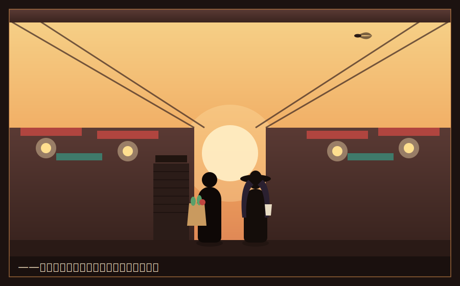

# 幕間　夏の商店街(しょうてんがい)

　一学期の、終業式の日。

　柏木は、いつものように眠そうな顔で、しかし、今朝の一問の代わりに、夏休みの課題を告げた。

「はい、宿題。一つだけだ」柏木は、黒板に、ぞんざいな字で書いた。『この夏、"生きてる商売"を一軒、現場で観察してこい』。「教科書の中の会社じゃない。店先の、生の商売だ。繁盛してる店でも、潰れかけの店でもいい。なぜ、そうなのか。お前の足で通って、お前の目で見て、千字で書け。……レポートの出来がよかった三人には、二学期、ちょっとした特典をやる。以上」

「特典?」誰かが食いついた。

「秘密だ」柏木は、けだるげに手を振った。「ま、期待するな。どうせお前ら、海だプールだで、忘れる」

　　　　＊

　湊の夏は、海でもプールでもなかった。

　実家に帰る旅費すら、惜しかった。母に電話で「元気だ」と伝えて、帰省は、盆に一泊だけ。残りの日々、湊は、学園の寮に居残り、丘の下の商店街――「星霜銀座」で、汗を流していた。

　山田青果店。間口の狭い、昔ながらの八百屋。店主のじいさんに頼み込んで、夏の間だけ、店番と配達を手伝わせてもらっていた。日当は、わずかな現金。それでも、居残る特待生には、ありがたい生活費だった。そして――柏木の課題の、絶好の観察現場でもあった。

　番場は、弟妹の世話に、田舎へ帰った。ひなは、「実家のクーラーとデータの海に潜る」と言って、姿を消した。だから、この夏、商店街に立つ湊は、一人だった。

「らっしゃい! きゅうり、今日は安いよ!」

　汗まみれで、湊は、声を張った。実家の乾物屋を手伝っていた頃の勘が、体に、まだ残っていた。値札を書き、客と喋り、重い箱を運ぶ。金持ちの学園とは、まるで別の世界。だが湊は、この蝉時雨と、汗と、野菜の匂いの中のほうが、どこか、息がしやすかった。

　その日も、夕方の値引き時間。湊が、売れ残りのトマトに「見切り品」の札を貼っていると――ふと、視線を感じた。

　店の前に、一人の少女が、立っていた。

　地味なワンピースに、つばの広い帽子、大きなサングラス。まるで正体を隠すみたいな格好。だが、その背筋の伸びた立ち姿と、銀色の髪を、湊が、見間違えるはずもなかった。

「……白鷺?」

　サングラスの奥で、その眉が、ぴくりと動いた。

「……なぜ、分かるの」

「分かるだろ、それだけ目立ってりゃ」湊は、呆れた。「変装のつもりか、それ。逆に浮いてるぞ」

　白鷺令子は、むっとしたように、サングラスを外した。氷のような瞳が、夏の西日に、きらりと光った。

「……あなたこそ。Sクラスの女王が、庶民の商店街にいるはずがない、とでも言いたげね」

「思ってはいる」

「わたしにも、柏木先生の課題があるの。『生きた商売を観察しろ』。それだけよ」令子は、つん、と顎を上げた。だが、その頬は、少し、赤かった。夏の暑さのせいだけ、ではなさそうだった。

　　　　＊

「――ちょうどいいわ」

　令子は、突然、そう言った。

「勝負しましょう、灰谷」

「は?」

「あなた、いつも言ってるでしょう。『現場』だの『値段の裏の都合』だの。だったら、証明してみせて」令子は、商店街を、ぐるりと指し示した。「この商店街で、いちばん『経営がうまい店』を、一軒ずつ選ぶ。理由をつけて。そして、そこで、それぞれ千円だけ使って、買い物をする。――どちらの選択が、より賢い『経営者の目』か。互いの主張を聞いて、相手が納得したら、負け。どう?」

　湊は、少し、面白くなってきた。

「乗った。負けたら?」

「負けたほうは、勝ったほうの言うことを、一つだけ聞く」令子は、不敵に笑った。「わたしが勝ったら――あなたのその減らず口を、一日、封印してもらおうかしら」

「上等だ。俺が勝ったら、その帽子とサングラス、ゴミ箱に捨ててもらう。目立ってしょうがない」

「……失礼ね」

　　　　＊

　一時間後。二人は、それぞれの「答え」の前に立っていた。

　令子が選んだのは、商店街の入口にできたばかりの、タピオカドリンクの店だった。若者の行列。回転の速いレジ。洗練された内装。

「立地は最高の角地。客の回転率は、この商店街で断トツ。SNSでの露出も多い。単価も高い」令子は、すらすらと語った。「売上、利益、成長性、どれを取っても一番。データが、そう言っているわ。……これが、経営のうまさよ」

　千円で、令子は、タピオカを二つ買った。慣れない手つきで、財布から千円札を出し――お釣りの小銭を、うまく数えられずに、もたついた。

「……白鷺。お前、自分で買い物、したことないだろ」

「っ……こ、これくらい、できるわよ!」

　結局、店員に小銭を数えてもらっていた。氷の女王の、意外な一面。湊は、噴き出しそうになるのを、堪えた。

　　　　＊

　湊が選んだのは、商店街の外れの、古い豆腐屋――「戸田豆腐店」だった。

　行列も、SNSも、洗練された内装も、何もない。客は、ぽつぽつと来る、近所の年寄りばかり。店先で、店主が、黙々と豆腐を切っていた。

「……地味ね」令子が、正直に言った。「行列も、若い客も、いない。これの、どこが」

「白鷺。お前、この店の何を見た?」湊は言った。「行列がない。でも、来る客は、全員、名前で呼ばれてる。全員、常連だ。三十年、同じ客が、毎日、豆腐を買いに来る。――流行り廃りがない。ブームも、来ないが、去りもしない」

　湊は、店主のじいさんに、豆腐を一丁頼んだ。ついでに、世間話みたいに、さらりと聞いた。原価のこと、大手スーパーの豆腐のこと、常連のこと。じいさんは、湊が商売人の目をしているのに気づいたのか、面白がって、ぽつぽつと答えた。

「大手の豆腐は、安いよ。でもね、うちのを食べたら、戻れないって、みんな言うんだ。だから、値段で殴られても、客は減らない。……欲を出して店を広げなかったのが、うちの、生き残ったコツかね」

　湊は、令子を見た。

「タピオカは、去年、この街になかった。来年、あるか? 分からない。ブームが去れば、あの角地の高い家賃が、牙を剥く。売上はでかいが、原価も家賃も、でかい。……一方、この豆腐屋は、三十年、潰れてない。派手さはゼロ。でも、利益率は堅く、常連という『参入障壁』がある。値段の裏に、三十年分の信頼が、積み上がってる」

　令子は、黙って、聞いていた。

「どっちが『経営がうまい』かは、何を大事にするかで、変わる。成長を取るなら、白鷺の勝ちだ。持続を取るなら、俺の勝ちだ。……つまり」

「――引き分け、ね」令子が、小さく、言った。

「ああ。悔しいが、お前の言うことにも、一理ある。派手さのない豆腐屋だけじゃ、街は、大きくならない。成長も、いる」

　令子は、少しの間、湊の横顔を見ていた。それから、ふっと、息を吐いた。

「……あなた、本当に、変な人ね。豆腐屋の親父と、あんなに楽しそうに喋る首席候補、聞いたことがないわ」

「褒め言葉として受け取っておく」

「褒めてないわ」

　だが、その口元は、ほんの少し、ゆるんでいた。

　　　　＊

　帰り道。夕暮れの商店街を、二人は、並んで歩いた。タピオカと、豆腐を提げて。妙な取り合わせだった。

　その途中、令子が、ふと、足を止めた。

　一軒の、シャッターの下りた店の前で。かつて、菓子屋だったらしい。色あせた看板に、辛うじて、店の名が読めた。もう、誰もいない、空っぽの店。

　令子は、その閉じたシャッターを、じっと見ていた。サングラスも外した、無防備な横顔。その瞳に、湊は、見たことのない色を、見た気がした。懐かしさと、痛みと――何か、深い、喪失のようなもの。

「……白鷺?」

「……なんでもない」

　令子は、すぐに、いつもの氷の表情に戻った。だが、湊は、その一瞬を、忘れなかった。

　――こいつにも、何か、あるのか。

　閉じたシャッターに、湊は、自分の実家を、重ねた。この完璧な財閥令嬢の胸の奥にも、もしかしたら、灰になった、何かがあるのかもしれない。その時は、まだ、それが何なのか、湊には知る由もなかった。

　別れ際、令子は、商店街の小さな菓子屋で、焼き菓子を一つだけ、買った。今度は、誰の手も借りずに、自分で、小銭を数えて。

　そして、その場で、一口、かじった。

　ほんの一瞬――氷の女王の顔が、幼い子どものように、ほどけた。何か、遠い日の記憶を、味わうみたいに。

「……どうした」

「……なんでもない、って、言ったでしょう」

　令子は、そっぽを向いた。だが、その声は、少しだけ、震えていた。

「灰谷。……今日のこと、誰にも言わないで。首席が、変装して、庶民の商店街で、豆腐屋の肩を持つ男と、引き分けた、なんて」

「言うわけないだろ。誰も信じない」

　令子は、小さく笑って、去っていった。夕暮れの、商店街の雑踏の中へ。その背中が見えなくなるまで、湊は、なぜだか、見送っていた。

　　　　＊

　その夜、湊は、山田青果店の二階を借りて、柏木の課題を書いた。

　『戸田豆腐店――なぜ、この店は三十年、潰れないのか』。

　書きながら、湊は、昼間の令子の言葉を、思い出していた。成長を取るか、持続を取るか。額を取るか、率を取るか。派手さを取るか、信頼を取るか。

　――経営には、いつも、二つの答えがある。

　どちらか一方だけでは、足りない。豆腐屋の堅実さと、タピオカ屋の成長。数字と、現場。あの氷の令嬢と、貧乏な自分。相反する二つを、両手に持てた奴だけが、きっと、本当の経営者になれる。

　湊は、ペンを走らせながら、少しだけ、令子に感謝していた。あの勝負が、一つ、答えの輪郭を、くっきりさせてくれた。

　窓の外、商店街のアーケードの向こうに、夏の星が、瞬いていた。

　やがて、蝉の声が、鈴虫に変わる頃。

　湊の、二度目の学期――そして、財前康介との、あの同盟が、始まろうとしていた。
