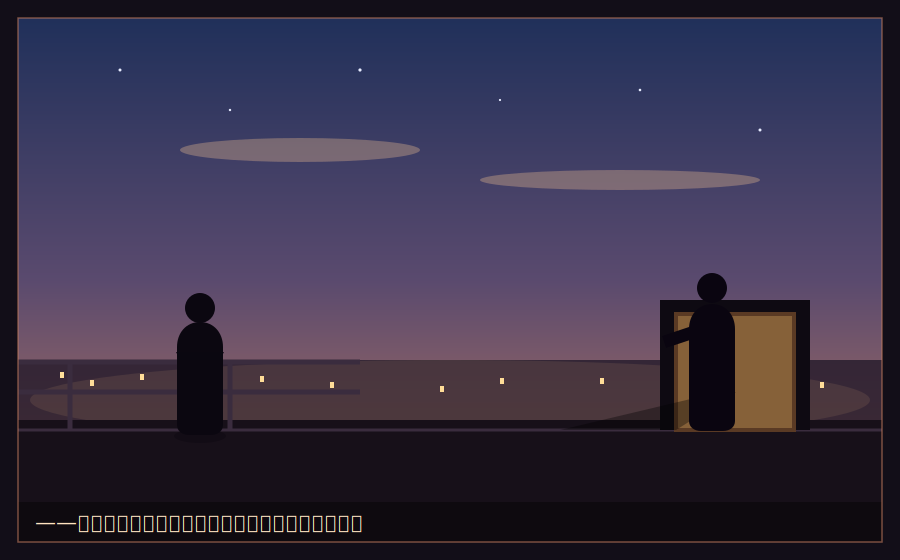

# 終章　夏の終わりに

　八月の、終わり。

　あれほど頭上を占めていた入道雲が、いつのまにか、高く、薄くなっていた。空の色が、少しだけ、秋に近づいていた。夕暮れが来るのが、日ごとに早くなる。夜には、蝉に代わって、鈴虫が鳴き始めていた。

　夏休みが、終わろうとしていた。

　　　　＊

　二学期の始業を前に、番場が、田舎から帰ってきた。

「灰谷ーっ! ただいま!」

　寮の部屋のドアを、蹴破る勢いで開けて、でかい体が飛び込んできた。真っ黒に日焼けして、両手に、田舎の土産の野菜だの干物だのを、抱えきれないほど提げている。

「弟や妹、元気だったか」

「おう! チビども、でかくなっててよ! 俺が学園で商売やってるって言ったら、目、キラキラさせてた」番場は、照れくさそうに、鼻をこすった。「……なあ、灰谷。俺、絶対、成り上がるからな。あいつらに、いい思い、させてやりたいんだ」

「ああ。一緒に、な」

「あーっ、二人だけで、いい話してる!」

　いつのまにか、ドアのところに、ひなが立っていた。彼女も、夏の間に会わないうちに、少しだけ、日に焼けたようだった。手には、いつものボロパソコン。

「データ、いっぱい仕込んできたよ」ひなが、にっと笑った。「二学期、暴れる準備、万端」

　三人は、顔を見合わせて、笑った。

　春に、この北向きの教室で出会った、寄せ集めの三人。あれから、たった一学期。だが、もう、ずっと昔からの仲間のような気がした。

　　　　＊

　その夜、湊は、一人、経営実践棟の屋上に上っていた。

　手すりにもたれ、丘の下の街の灯りを、見下ろす。夏の終わりの、少し湿った風が、頬を撫でていった。

　――この半年で、俺は、何を掴んだだろう。

　湊は、指を、折って数えた。

　金がなくても、価値は生めること。物がなくても、商売はできること。そして――値段で戦ってはいけないこと。安売り合戦は、資本のある者の土俵で、乗った瞬間に負ける。父が死んだのは、そこだ。戦うのは、値段じゃない。信用だ。額じゃなく、率で。

　豆腐屋の堅実さと、タピオカ屋の成長。持続と、拡大。数字と、現場。相反する二つを、両手に持てた者だけが、本当の経営者になれる。あの、氷の令嬢が、教えてくれたことだ。

　まだ、答えの全部じゃない。「なぜ、店は潰れるのか」――その問いの、輪郭が、少しだけ、くっきりしただけだ。

　だが、確かに、一歩は、進んだ。

　クラスは、まだFのままだ。一学期の資本効率一位も、しょせんは、小さな大会の、小さな快挙。この学園の頂点――白鷺令子のいるSクラスは、まだ、はるかな高みにある。二学期には、もっと大きな戦いが、待っているだろう。

「……上等だ」

　湊は、街の灯りに向かって、呟いた。灰の底から、まだ、一段目を、登ったばかりだ。

　　　　＊

　屋上から降りようとした、その時だった。

「よう、灰谷。精が出るな」

　階段の踊り場に、爽やかな笑みの男が、立っていた。財前康介。夏の間に、どこかで会ったきりの――あの、Cクラスの同級生。

「財前……。この間の、忠告。助かった」湊は、素直に礼を言った。トライアルの危機を、いち早く教えてくれたのは、この男だった。「あれで、早く手を打てた」

「気にすんな。困ってる奴を見ると、放っとけない性分でな」財前は、へらりと笑った。「それより、お前らのあの巻き返し、見事だったよ。安売りに乗らずに、信用で殴り返す。……痺れたね。正直、惚れそうになった」

「……何が言いたい」

「なあ、灰谷」財前は、一歩、距離を詰めた。その笑みは、爽やかで、人好きがして、そして――どこか、底が見えなかった。「二学期から、俺と、組まないか」

　湊の眉が、動いた。

「俺は、地方の農家から、規格外の野菜を安く仕入れるルートを持ってる。味は一級品なのに、形が悪いだけで捨てられてる野菜だ。……もったいないだろ? でも、俺には、売る力がない。お前らには、あの、信用のネットワークがある。俺が仕入れて、お前らが捌く。――最強の同盟だと思わないか?」

　捨てられる価値を、拾う。その発想は、湊自身の思想と、驚くほど、重なっていた。

　だからこそ――湊の胸の奥で、小さな警鐘が、鳴った。うますぎる、と。値段の裏には、必ず、都合がある。この爽やかな笑みの、裏の都合は、何だ?

　だが、その警鐘は、あまりに小さく、そして、財前の差し出す手は、あまりに、魅力的だった。

「……話だけは、聞いてやる」

　湊は、そう答えていた。

　財前の笑みが、深くなった。夕闇の中で、その目の奥に、一瞬、湊の知らない色が、よぎった気がした。だが、それが何なのかを、この時の湊は、まだ、知る由もなかった。

　鈴虫が、鳴いていた。

　――夏が、終わる。

　そして、灰谷湊の、二度目の学期が――彼を、初めての『どん底』へと突き落とす、あの二学期が、静かに、幕を開けようとしていた。

　　　　＊

　＜第一巻・完＞

　　　　＊

　――第二巻・予告――

　二学期。財前康介との『同盟』で、チーム・アッシュは、かつてない急成長を遂げる。

　だが、学園最大の買収戦「アライアンス・ウォーズ」の渦中で、灰谷湊は、初めて知る。

　差し出された手の中に、握手のふりをした、刃があることを。

　全てを奪われ、灰の底へ。涙と、負債と、裏切り。そこから湊は、どう這い上がるのか。

　氷の女王・白鷺令子の、凍てついた心の、その理由(わけ)。

　かつての王者・黒崎遼が、灰谷湊に授ける、世界の残酷な法則。

　そして――財前康介が、なぜ、ここまで『奪うこと』に取り憑かれたのか。その、哀しき原体験。

　『灰からはじめる経営学園』第二巻、灰の底からの、本当の下剋上が、始まる。

　※第2巻・準備稿は [`vol2/`](vol2/README.md) に収録。
