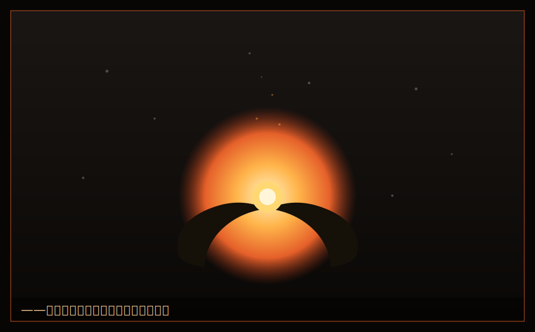

# 第五章　灰の底で

　どん底からの再起は、簡単ではなかった。

　買収戦で無一文になったチーム・アッシュには、事業もネットワークも残っていなかった。かつて湊たちに仕事を頼んでいた上位クラスは、今や令子の傘下に組み込まれたネットワークを使っていた。市場は、奪われていた。

「参ったな……」番場が、頭を掻いた。「仲介所は、白鷺のものになっちまった。同じことをもう一回やっても、本家がある以上、勝てない」

「同じことは、やらない」湊は、静かに言った。「あれは、もう財前に模倣され、白鷺に奪われた。既に古い。俺たちは、次の一手を打つ」

　だが、その「次の一手」が、見えなかった。

　三人は、来る日も来る日も、空になった教室で頭を突き合わせた。アイデアは出た。だが、どれも、決め手に欠けた。焦りだけが、募っていった。

　　　　＊

　ある夜。

　三人は、教室に残って、カップ麺をすすっていた。金がないから、それが夕食だった。買収戦で負債を抱えた今、まともな飯すら、贅沢だった。

「なあ、灰谷」番場が、麺を啜りながら、ぽつりと言った。「俺さ……財前を、信じたの、俺だったよな。『いい奴だ』って、俺が言った。俺が、あいつを、お前らに引き合わせちまった」

「番場のせいじゃない、って言っただろ」

「分かってる。でも、堪えるんだよ」番場は、割り箸を、じっと見た。「俺、人を信じるのだけは、得意なつもりだった。金もない、頭もそんなによくない。でも、人に好かれるのだけは、俺の取り柄だと思ってた。……それが、いちばんでかい裏切りを、招いた。俺の取り柄、間違ってたのかなって」

　湊は、黙って、番場の言葉を待った。

「うちさ、兄弟六人いるんだ。俺が長男」番場は、ぽつぽつと話し始めた。「親父は、小さな鉄工所やってた。真面目で、腕はよかった。でも、いちばんでかい取引先が、ある日いきなり、契約を切った。安く作れる海外の工場に、乗り換えたんだと。……それで、工場は、潰れた」

　湊の胸が、ざわついた。それは、灰谷乾物店と、同じ形の話だった。

「親父は、何も悪いことしてない。ただ、真面目に、いい物を作ってただけだ。なのに、切られた。……あの時、俺、中学だった。弟や妹に、飯を食わせなきゃいけなくて、新聞配達も、皿洗いも、なんでもやった。そこで、学んだんだ。金のない人間に残された、たった一つの元手は――『人に信じてもらうこと』だけだって」

　番場は、顔を上げた。目が、少し赤かった。

「だから俺、人を信じることに、全部賭けてきた。それが、財前に裏切られて……正直、自分の生き方まで、否定された気がしたんだ」

「番場」湊は、静かに言った。「お前の取り柄は、間違ってない」

「……」

「財前は、お前の『信じる力』を、利用した。でもな、それは、お前の力が本物だった証拠だ。偽物なら、利用する価値もない。お前が人に好かれるのは、才能だ。……俺は、その才能に、助けられてる。ずっと」

　番場は、洟をすすって、へへ、と笑った。「……お前、ほんと、たまに、いいこと言うよな」

「たまに、は余計だ」

「あーもう、湿っぽいのは苦手!」

　ひなが、突然、大きな声を出した。パソコンの陰から。だが、その声は、少し、震えていた。

「……あたしもさ」ひなは、画面を見つめたまま、言った。「あたし、昔から、数字が見えすぎるの。人の顔色より、データのほうが、正直だから、好き。……でも、それで、気味悪がられてきた。小学校の時、クラスの子の誕生日プレゼントの相場、全部当てたら、『機械みたい』って言われて。中学の時は、あたしの分析能力、目当てで近づいてきた先輩たちがいてさ。さんざん使われて、要らなくなったら、ぽいって捨てられた」

　ひなの指が、キーボードの上で、止まった。

「だから、あたし、人を信じるの、やめたの。データは、裏切らない。人は、裏切る。……灰谷くんに誘われた時も、正直、思ってた。『こいつも、あたしの頭が目当てで、いつか捨てるんだろ』って」

「ひな……」番場が、言葉を失った。

「でもさ」ひなは、ようやく顔を上げた。目に、涙が滲んでいた。「財前に、全部奪われて、チームが潰れた時。灰谷くん、あたしのデータのせいにも、しなかった。あたしを、切り捨てもしなかった。あんな時でも、『もう一度、やる気はあるか』って、あたしに、聞いた。……あたしを、道具じゃなくて、仲間として」

　ひなは、涙を、乱暴にぬぐった。

「あたしが、このチーム、辞めない理由。それだけ。あんたは、あたしを、捨てない。だから、あたしも、あんたを、捨てない。……それだけだよ、ばか」

　湊は、二人を、見つめた。

　番場も、ひなも、自分と同じだった。奪われた側の人間。真面目が報われず、才能が利用され、それでも、這い上がろうとしている、灰の中の火種。

　――俺は、一人で来たつもりだった。でも、違った。

　湊は、思った。奪われても、残るものがある。それは、同じ痛みを知る、仲間だ。財前が「演技」で作った、偽物の絆じゃない。互いの傷を見せ合った者だけが持てる、本物の。

「……ありがとうな。二人とも」湊は、珍しく、素直に言った。「絶対、勝つぞ。今度は、奪われない勝ち方で」

「「おう」」

　冷めたカップ麺が、その夜は、やけに、うまかった。

　　　　＊

「――ずいぶん、辛気くさい顔をしてるな。負け犬の会合か?」

　声がしたのは、経営実践棟の屋上だった。湊が、一人で考えを整理しに来た場所。

　振り向くと、一人の上級生が、フェンスにもたれて煙草――ではなく、棒付きキャンディを咥えていた。三年生。皮肉っぽい笑みを浮かべた、鋭い目つきの男。

　黒崎遼(くろさき りょう)。かつてこの学園の頂点、Sクラス首席に立ちながら、ある年、突如としてトップから転落した「伝説の落伍者」――そう噂される男だった。

「あんた……黒崎、先輩」

「俺を知ってるのか。落ちぶれた元王者を」黒崎は、鼻で笑った。「お前、灰谷だろ。買収戦で、財前にしてやられた奴。学園中の噂だぜ。『Fクラス上がりの成り上がりが、同盟相手に裏切られて丸裸にされた』ってな」

　湊は、拳を握った。

「……何が言いたい」

「別に。憐れんでるだけだ」黒崎は、キャンディを鳴らした。「なあ、灰谷。お前、なんで財前に負けたか、分かるか?」

「契約の穴を、突かれたからだ。株を、預けるべきじゃなかった」

「違うな」黒崎は、あっさりと否定した。「それは結果だ。原因じゃない。お前が負けた本当の理由は――**お前が『価値を生む』ことしか考えてなかったからだ**」

　湊は、顔を上げた。

「お前は、いい物を作れば、いい価値を生めば、報われると思ってた。だから、無から有を生むことに、全力を注いだ。それ自体は、正しい。だが、片手落ちだ」黒崎は、フェンスを離れ、湊に近づいた。「経営には、二つの力がいる。**価値を生む力**と、**生んだ価値を、自分のものとして握り続ける力**だ。前者を『創造』、後者を『専有(せんゆう)』と呼ぶ。お前は、創造は天才的だった。だが、専有を知らなかった。だから、生んだそばから、財前と白鷺に、根こそぎ持っていかれた」

　――専有。

　その言葉が、湊の胸に、深く突き刺さった。

「考えてみろ」黒崎は続けた。「お前の仲介ネットワークは、なぜ簡単に奪われた? 誰でも真似できたからだ。参入障壁がなかった。お前の作った価値は、お前でなくても回せた。だから、白鷺は事業ごと吸収して、お前を捨てられた。お前は、代わりのきく人間だったんだよ。ビジネスの世界じゃ、それを『交渉力がない』と言う」

「じゃあ、どうすれば……」

「価値を生むだけじゃなく、『お前でなければ回らない』構造を作れ。奪っても、お前がいなきゃ機能しない。そういう価値を、生め。――それができたとき、初めて、お前は誰にも奪われない経営者になる」

　黒崎は、キャンディの棒を、くるりと回した。

「俺がなんで首席から落ちたか、知ってるか。俺も、お前と同じ間違いをしたからだ。いい事業を作った。だが、専有を怠った。信じた仲間に、丸ごと持っていかれた。……お前を見てると、昔の自分を見てるようで、虫唾が走る」

　黒崎は、背を向けた。

「まあ、せいぜい足掻け。灰から這い上がれるもんなら、な」

　その背中に、湊は、声をかけた。

「先輩! 一つ、聞かせてくれ」

　黒崎が、足を止めた。

「あんたは……もう一度、頂点を狙わないのか。同じ間違いを、二度としないように」

　黒崎は、振り返らなかった。だが、その肩が、微かに揺れた。

「……さあな。狙う理由が、なくなったんでな」

　それだけ言って、黒崎は屋上を去った。

　だが、湊は、確かに見た。去り際の黒崎の目に、消えかけた火種が、まだ、燻っているのを。

　　　　＊

　その夜、湊は教室で、番場とひなに、黒崎の言葉を伝えた。

「創造と、専有」ひなが、繰り返した。「あたしたちは、価値を生んだ。でも、それを『あたしたちのもの』として握る力が、なかった。……確かに、その通りかも」

「奪われない価値、か」番場が、腕を組んだ。「でも、どうやって作るんだ? どんな事業だって、うまくいけば真似される。真似されない事業なんて、あるのか?」

　湊は、じっと考えていた。黒崎の言葉が、頭の中で回っていた。

　*お前でなければ回らない構造を作れ。*

　――俺でなければ、回らないもの。俺にしか、できないこと。俺が、他の誰とも違うこと。

　湊は、目を閉じた。自分の中に、何があるか。金はない。コネもない。才能の保証もない。あるのは――。

　あるのは、あの、灰色のシャッターの記憶だった。

　潰れていく店を、いちばん近くで見た経験。なぜ店が潰れるのか、その問いを、二年間、抱え続けた執念。田村のばあちゃんの十円玉。父の言葉。「値段の裏には、都合がある」。

　――待てよ。

　湊は、目を開けた。

「……番場。ひな。俺たちは、なんで白鷺に負けたと思う?」

「え? 財前に裏切られたから……」

「違う。もっと根本的な話だ」湊は、身を乗り出した。「俺たちの仲介事業は、確かに効率がよかった。でも、あれは『既にある需要と供給を、繋ぐ』だけの事業だった。誰かがやらなくても、いずれ誰かが繋いだかもしれない。代わりが、きいた。――だから、奪われた」

「うん……」

「じゃあ、代わりのきかない事業って、何だ? それは――**誰も、まだ気づいていない価値を、最初に見つける事業**だ」湊の目が、光った。「学園には、金持ちの子ばっかりが目を向ける、『儲かる市場』がある。みんな、そこに群がる。でも、その裏で、誰も見ていない市場がある。誰も価値だと思っていない、捨てられている価値がある。――それを、俺たちだけが、拾う」

「捨てられてる価値……」ひなが、はっとした。「規格外野菜みたいな?」

「そうだ。だが、財前がやったのは、その野菜を『安く仕入れて高く売る』だけだった。だから真似された。俺たちがやるのは、その先だ。**捨てられている価値を見つける『目』そのものを、事業にする**」

　湊は、黒板に、一つの言葉を書いた。

　『**見捨てられた市場(ロスト・マーケット)**』

「学園には、負けたチーム、潰れたカンパニー、燻ってる下位クラスが、山ほどいる。白鷺みたいな勝ち組は、そいつらを『使えない資産』として切り捨てる。財前みたいな奴は、そいつらを『安く買い叩く獲物』としか見ない。――でも、俺は知ってる。灰の中にも、火種はある。潰れた店にも、田村のばあちゃんに愛された煮干しがあった」

　湊の声が、熱を帯びた。

「俺たちは、その火種を、拾って回る。潰れたチームの持ってた技術、燻ってる下位クラスの隠れた才能、切り捨てられた事業の、まだ生きてる部分。それを見つけて、繋いで、もう一度、価値に変える。――『再生専門』のカンパニーだ。白鷺には、これはできない。あいつには、灰の中の火種が、見えないからだ。金持ちには、貧乏人の価値が、見えない」

　番場が、ゆっくりと、拳を握った。

「……それ、俺たちにしか、できない事業だ」

「そうだ。俺たちは、灰の底を這ってきた。だから、灰の中の火種が、見える。これが――」湊は、自分の胸を、指さした。「これが、俺たちの『専有』だ。俺たちでなきゃ、回らない。俺たちの、経験そのものが、参入障壁になる」

　ひなが、パソコンを開いた。指が、猛然と動き始めた。

「潰れたチーム、リストアップする。彼らが持ってた資産、技術、人材……データ、全部あたしの頭に入ってる。どれが再生可能か、片っ端から洗い出す!」

　番場が、立ち上がった。

「俺は、下位クラス回ってくる! 燻ってる奴らに、声かける! 『お前の、そのくすぶってる才能、俺たちが火をつける』ってな!」

　湊は、二人を見て、頷いた。

　灰の底に、火が回り始めた。今度の火は、簡単には消えない。なぜなら、この火は、灰の中からしか、生まれないものだから。

　――財前。お前は、俺を「詩人」と笑った。奪える奴が勝つ、と言った。

　湊は、黒板の『見捨てられた市場』の文字を、見つめた。

　――だが、覚えとけ。奪うだけの奴には、いつか、奪うものがなくなる。俺は、生み続ける。灰の中から、何度でも。それが、奪う者には、絶対にできないことだ。

　半期末のクラス再編、そして次のイベント。

　湊は、そこで、財前と白鷺に、もう一度、相まみえることになる。

　今度は、負けない。奪われない。

　灰の底から、掴みにいく。

　星(スター)を。
