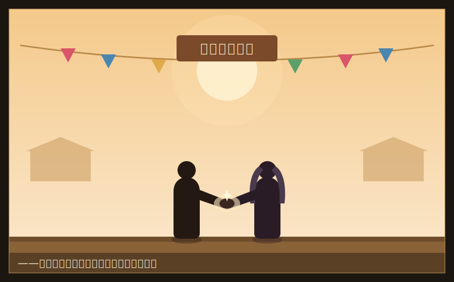

# 第六章　総力戦

　「見捨てられた市場(ロスト・マーケット)」――再生専門カンパニーは、静かに、だが着実に、動き始めた。

　湊たちは、まず、買収戦で解体された弱小チームに声をかけた。潰れたチームには、まだ使える資産が眠っていた。例えば、あるチームは学園近隣の高齢者向け配食のノウハウを持っていたが、集客に失敗して潰れた。あるチームは、優れた在庫管理システムを組んでいたが、売る商品がなくて畳んだ。

　それぞれ単体では、死んでいた。だが――。

「配食のノウハウと、在庫管理システム。この二つを、繋ぐ」湊は言った。「高齢者は、毎日決まった時間に、決まった量の食事が要る。需要が、読める。読める需要には、在庫管理が効く。ロスが減る。ロスが減れば、値段が下げられる。値段が下がれば、もっと売れる」

　番場が、目を丸くした。「潰れた二つを、繋いだら、生き返るのか」

「一つずつじゃ死んでたものが、繋ぐと生きる。それが、再生だ」湊は言った。「そして、この『繋ぎ方』は、俺たちにしか分からない。なぜなら、俺たちは、両方のチームが『なぜ潰れたか』を、聞き込んで知ってるからだ。潰れた理由を知ってる奴だけが、正しく繋げる」

　ひなが、データを叩きながら、にやりとした。

「参入障壁、爆誕だね。白鷺には、絶対真似できない。あいつ、潰れたチームのことなんか、資産価値ゼロだと思って、話も聞いてないもん」

　　　　＊

　湊たちが拾い集めた「灰の中の火種」は、一つ、また一つと、事業として蘇っていった。

　燻っていた下位クラスの生徒たちも、集まってきた。デザインの才能はあるのに事業に活かせなかった者。人当たりはいいのに商材がなかった者。彼らは、白鷺のような勝ち組からは「使えない」と切り捨てられ、財前のような策略家からは「利用価値がない」と無視されてきた。

　だが、湊は違った。

「お前の、その『使えない』と言われた才能。それが、どこで火になるか、俺には見える」

　湊は、一人ひとりに、居場所を作った。かつて自分が、番場とひなに拾われたように。

　チーム・アッシュは、いつしか、二十人を超える「灰の集団」になっていた。学園中の、見捨てられた者たちの、拠り所に。

　だが、それは同時に、白鷺令子と財前康介の、警戒を招いた。

　　　　＊

　半期末。

　学園最大のイベント――**「グランド・カンパニー・バトル」**、通称・総力戦が告知された。

　これは、これまでのすべてを賭ける、集大成の戦いだった。各カンパニーが、半期の全資産を投じ、最終決戦の市場で競い合う。舞台は、学園が近隣都市と提携して開く、実際の商業イベント「星霜マルシェ」。学園の外の、本物の客を相手にした、真剣勝負。

　優勝したカンパニーは、次の半期、Sクラスへの昇格権と、莫大な追加資本を得る。敗れたカンパニーは――解体。

　三つの勢力が、頂点を争った。

　一つ、**白鷺令子のカンパニー**。財閥の資本力と、買収で吸収した数々の事業。学園最強の、王者。

　一つ、**財前康介のカンパニー**。白鷺の傘下で頭角を現し、今や独立勢力として台頭。策略と模倣で、のし上がった新興勢力。

　そして――**灰谷湊のチーム・アッシュ**。灰の中から蘇った、再生専門の、寄せ集めの集団。

　　　　＊

　総力戦の前夜。

　湊のもとに、財前が訪ねてきた。一人で。

「よう、灰谷。しぶといな、お前」財前は、いつもの笑みを浮かべた。だが、その笑みには、以前のような余裕がなかった。「まさか、ゴミみたいな潰れチームを寄せ集めて、ここまで来るとはな。正直、見くびってたよ」

「用件は」湊は、冷たく言った。

「取引だ」財前は、声を潜めた。「明日の総力戦、白鷺の令嬢は強い。まともにやったら、俺もお前も勝てない。だから――手を組もう。二人で、白鷺を潰す。その後で、決着をつければいい。どうだ、悪くない話だろ?」

　湊は、財前を、じっと見た。

　――また、同盟。また、この手か。

「財前」湊は、静かに言った。「お前は、俺を一度、裏切った。その俺に、もう一度、手を組もうと言う。……お前、俺を、まだ舐めてるのか?」

「舐めてるんじゃない。買ってるんだ」財前は、笑った。「お前は、感情で動く男じゃない。数字で動く男だ。白鷺を潰すのに、俺と組むのが得なら、お前は組む。過去の恨みなんかで、損得を曲げる男じゃない。――そうだろ?」

　その言葉には、財前なりの、湊への理解があった。皮肉なことに。

　湊は、少し、間を置いた。それから――笑った。

「その通りだ。俺は、感情で損得を曲げない」

　財前の目が、輝いた。「じゃあ――」

「だから、断る」湊は、言った。「お前と組むのは、損だからだ。財前、お前は『奪う』ことしかできない。俺が白鷺を潰すのに手を貸したら、次に潰されるのは俺だ。お前は、また俺を裏切る。それは、感情じゃない。計算だ。お前という人間の、行動原理から導かれる、確実な予測だ」

　財前の笑みが、消えた。

「……そうかい。じゃあ、お前も、白鷺に潰される側だ」

「かもな」湊は言った。「だが、覚えとけ、財前。お前がなぜ、俺に手を組もうと言いに来たか。それは、お前一人じゃ、白鷺に勝てないと分かってるからだ。お前は、奪うものがなきゃ、何もできない。自分では、何も生めない。――それが、お前の限界だ」

　財前は、何も言わずに、去っていった。

　その背中は、以前見た、勝ち誇った背中とは、違っていた。

　　　　＊

　総力戦、当日。

　「星霜マルシェ」の会場は、近隣都市の広場だった。本物の客が、数千人。学園のカンパニーが、それぞれの事業を、本物の市場で試す。

　白鷺令子のカンパニーは、高級ブランドの物販で、圧倒的な集客を見せた。財閥の名を冠したブースには、行列ができた。

　財前康介のカンパニーは、白鷺の人気商品を巧みに模倣し、少し安く売ることで、客を横取りしていった。相変わらずの、模倣と横取りの戦法。

　そして、チーム・アッシュは――。

「ブース、地味だね」ひなが、苦笑した。「白鷺のとこは、あんなに派手なのに」

　湊たちのブースは、目立たなかった。だが、そこで売っていたのは、他のどこにもないものだった。

　潰れたチームから拾った、高齢者向け配食のノウハウ。それを、この日のために、一つの形にしていた。

　――「マルシェ・コンシェルジュ」。

　会場に来た高齢の客、体の不自由な客、子連れの客。広い会場を歩き回るのが大変な人たち。湊たちは、彼らに寄り添い、「何が欲しいか」を聞き、会場中の店から、最適な商品を、集めて届けた。

　それは、派手な物販ではなかった。目立つ商売でもなかった。

　だが――白鷺も、財前も、まったく見ていなかった客層だった。

「金を落とすのは、行列に並べる若い客だけじゃない」湊は言った。「行列に並べない客が、この会場には、たくさんいる。白鷺は、その客が『見えてない』。財前は、その客に『興味がない』。――でも、俺たちには、見える。だって俺たちは、田村のばあちゃんに、煮干しを届けてきたんだから」

　高齢の客が、湊たちのサービスに、涙ぐんだ。

「あんたたちみたいな子がいてくれて、助かるよ。もう、あたしゃ、こういう賑やかなとこ、歩くのがしんどくてね……」

　湊は、その手に、そっと商品を渡した。田村のばあちゃんに、煮干しを渡したときと、同じように。

　――値段の裏には、都合がある。この人の都合を、俺は知ってる。

　口コミは、静かに、だが確実に広がった。「あそこの学生さんに頼めば、なんでも運んでくれる」。会場中の、行列に並べない客が、チーム・アッシュのもとに集まってきた。

　そして――ここに、湊の仕掛けた「専有」の罠があった。

　チーム・アッシュのコンシェルジュは、会場中の店から商品を集めて届ける。つまり、他の全店の売上に、チーム・アッシュが「橋渡し」として関わる。白鷺の店の商品も、財前の店の商品も、行列に並べない客に届けるのは――チーム・アッシュだった。

「ひな、データは」湊が聞いた。

「取れてる! 会場全体の、誰が、何を、いつ買ったか。行列に並べない客の購買データ――こんなの、うちしか持ってない!」ひなが、興奮して叫んだ。「白鷺も財前も、自分の店の前しか見てない。でもあたしたちは、会場全部を、繋いでる! 会場の『流れ』が、全部見える!」

　湊は、頷いた。

「それが、俺たちの武器だ。俺たちは、どこか一つの店で勝つんじゃない。会場全体を『繋ぐ』ことで、会場そのものを、握る」

　午後、マルシェの主催都市の担当者が、チーム・アッシュのブースを訪れた。

「君たちのサービス、素晴らしいね。うちの市は、高齢化が進んでて、こういう『買い物弱者』の支援が、ずっと課題だったんだ。……もし良ければ、来月から、市の商店街で、このサービスを継続してくれないか。市が、正式に業務委託したい」

　会場が、どよめいた。

　学園のイベントを超えて、本物の自治体から、本物の仕事の依頼。それは、他のどのカンパニーも、成し得なかったことだった。白鷺の物販も、財前の模倣も、その日限りの売上で終わる。だが、チーム・アッシュは――**継続する事業**を、本物の社会から、勝ち取った。

「これが……俺たちの答えだ」湊は、静かに言った。「白鷺は、金で、その日の売上を買った。財前は、模倣で、他人の客を奪った。でも、俺たちは――誰も見ていなかった価値を、見つけて、本物の需要に、繋いだ。奪ったんじゃない。生んだんだ。だから、明日も、来月も、続く」

　　　　＊

　総力戦の結果発表。

　単日の売上額では、白鷺令子のカンパニーが、一位だった。財閥の資本力は、伊達ではなかった。

　だが――総力戦の評価は、売上額だけではなかった。

「本イベントは、単なる売上競争ではない」審査を務めた学園長が、壇上で告げた。「諸君が、いかにして『持続可能な価値』を生んだか。市場に、社会に、どれだけの意味を残したか。それを含めて、審査する」

　学園長の目が、湊たちのブースに向いた。

「チーム・アッシュ。彼らは、この会場で、最も少ない資本で、最も大きな『社会的価値』を生んだ。彼らのサービスは、イベントの後も、自治体の事業として継続する。一日の売上ではなく、未来の需要を、創造した。――これこそ、経営の、最も高貴な形だ」

　電光掲示板に、最終順位が映し出された。

　**総合優勝　チーム・アッシュ(灰谷湊)**

　会場が、揺れた。

　番場が、湊を抱え上げた。「灰谷ァ! やったぞ! 優勝だ! 優勝だァ!!」

　ひなが、パソコンを抱えたまま、飛び跳ねて、泣いていた。「勝った……あたしたち、勝った……! ゼロから、もう一回、勝ったよ……!」

　寄せ集めの、灰の集団が、歓声を上げた。かつて「使えない」と切り捨てられ、「利用価値がない」と無視された者たちが、今、学園の頂点に立っていた。

　湊は、番場に抱え上げられながら、空を見上げた。

　――親父。俺、掴んだよ。

　なぜ店が潰れるのか。二年間、抱え続けた問い。その答えの、片鱗を。

　店が潰れるのは、味が悪いからじゃない。努力が足りないからでもない。生んだ価値を、守れなかったから。奪われたから。そして――誰も見ていない価値に、気づけなかったから。

　湊は、その全部を、この半期で、体で学んだ。

　　　　＊

　群衆の向こうに、白鷺令子が、立っていた。

　彼女は、負けた。単日売上では勝ったのに、総合では、灰の集団に敗れた。財閥の令嬢が、Fクラス上がりの貧乏人に。

　だが、その顔に、屈辱の色はなかった。

　令子は、湊のもとに、ゆっくりと歩いてきた。

「……灰谷湊」

「白鷺」

　二人は、向き合った。あの日、噴水の前で、初めて言葉を交わしたときのように。

「あなたに、言っておくことがあるわ」令子は、まっすぐに湊を見た。「買収戦で、あなたたちを潰したこと。あれは、財前の話に乗った。あなたたちのネットワークが、目障りだったから。……冷徹な、正しい経営判断だと思っていた」

「……」

「でも、間違っていたわ」令子は、静かに続けた。「わたしは、あなたたちを『資産』として買った。そして、効率だけで、切り刻んだ。番場くんが築いた信頼も、桃園さんが組んだ仕組みも、全部、数字でしか見なかった。――そうやって切り捨てたものが、灰の中で、もう一度、火になった。今日、それに、優勝をさらわれた」

　令子は、少しだけ、目を伏せた。

「……昔、わたしにも、数字にならない場所があったの。祖母が営んでいた、小さな菓子店。わたしが、世界でいちばん好きだった場所」

　湊は、黙って、聞いていた。氷の女王が、こんな話をするとは、思わなかった。

「万年赤字だった。だから、白鷺の家が、畳んだ。……わたしが八つの時に。父は言ったわ。『感傷は、赤字の言い訳にはならない』って。――そう。あなたに最初に言った、あの言葉。あれは、わたしが、父に言われた言葉なの」

　令子の声が、わずかに、揺れた。

「わたしは、あの言葉を信じて、生きてきた。愛したものは、失う。だったら、愛さなければいい、と。……でも、買収戦で、あなたたちを切り刻んだ時、気づいたの。わたしがやっていたのは、祖母の店を、もう一度、この手で畳むことだった。父と、同じことを。――そして、あなたたちは、わたしが一生かけて諦めたものを、握って、離さなかった。愛したもので、勝ってみせた」

　令子は、初めて、湊に向かって、頭を下げた。

「わたしは、あなたから、学ぶことがあるみたい。……悔しいけれど」

　湊は、少し驚いた。氷の女王が、頭を下げるとは。

「白鷺」湊は言った。「あんたは、間違ってなかった。経営は、数字だ。効率だ。感傷は、赤字の言い訳にはならない。――あんたが、俺に最初に言ったことだ。あれは、正しい」

　令子が、顔を上げた。

「でも、それだけじゃ、足りなかった。数字の裏には、人がいる。値段の裏には、都合がある。その両方を、見なきゃいけない。……俺は、それを、あんたに教わった。あんたの冷たい言葉が、俺を、鍛えてくれた」

　湊は、手を差し出した。

「白鷺令子。次は、正々堂々、やろう。奪い合いじゃなく――生み合いで。どっちが、より大きな価値を生めるか」

　令子は、その手を、じっと見た。

　そして――ほんの少しだけ、口元を緩めて、握り返した。

「……いいでしょう。受けて立つわ、灰谷。次は、負けない」

　その手は、意外にも、温かかった。財前の偽物の温かさとは、まるで違う。本物の、ライバルの手の温もりだった。

　手を離す前に、令子は、ずっと檻の中から聞きたかったことを、口にした。ずっと、涸らしていたはずの問いを。

「灰谷。一つだけ、教えて」令子の声は、いつもの氷とは、少し違った。「あなたは、どうして……好きなものを、好きだと、言い続けられるの。愛したものは、いつか、奪われるのに」

　湊は、少し考えて、答えた。

「奪われるからだよ」

「……え?」

「奪われて、失って、それでも好きだったものは、俺の中に残る。うちの店は潰れた。でも、親父の煮干しがうまかったことは、誰にも奪えない。田村のばあちゃんが、それを好きだったことも。――好きだと言い続けるのは、奪われないための、たった一つの方法なんだ。心の中のものは、誰にも、整理できない」

　令子は、目を見開いた。

　その答えは、八つの年から、彼女がずっと探していたものだった。祖母が最後に遺した言葉の、意味だった。好きだと言えるのは、弱さじゃない。奪われても消えない、いちばん強い、専有のかたち。

「……そう」

　令子は、俯いた。だが、その口元は、微かに、ほどけていた。硝子の檻に、細い、ひびが入った音がした――ような気が、した。

「ありがとう」

　その言葉は、あまりに小さくて、湊の耳には、届かなかったかもしれない。

　　　　＊

　少し離れた場所で。

　財前康介が、一人、その光景を見ていた。

　総力戦で、彼のカンパニーは、模倣と横取りだけでは伸びきれず、中位に沈んでいた。奪う相手が強すぎると、奪えない。生む力を持たない者の、限界だった。

　財前は、拳を握りしめた。その顔には、初めて――焦りと、そして、ほんの少しの、悔恨のようなものが、滲んでいた。

「……灰谷」

　彼は、小さく呟いた。それが、負け惜しみなのか、それとも別の何かなのか。誰にも、分からなかった。

　だが、財前の物語は、まだ、終わっていない。

　　　　＊

　屋上から、その全てを見下ろす影があった。

　黒崎遼。棒付きキャンディを咥えて、灰谷湊の優勝を、静かに見ていた。

「……灰から、火を起こしたか。俺には、できなかったことを」

　黒崎の目に、燻っていた火種が、少しだけ、大きくなった。

「面白くなってきたじゃねえか、灰谷。――お前が、どこまでいくか。見届けてやるよ」

　彼は、キャンディの棒を、くるりと回して、笑った。かつての王者の、静かな笑みを。
