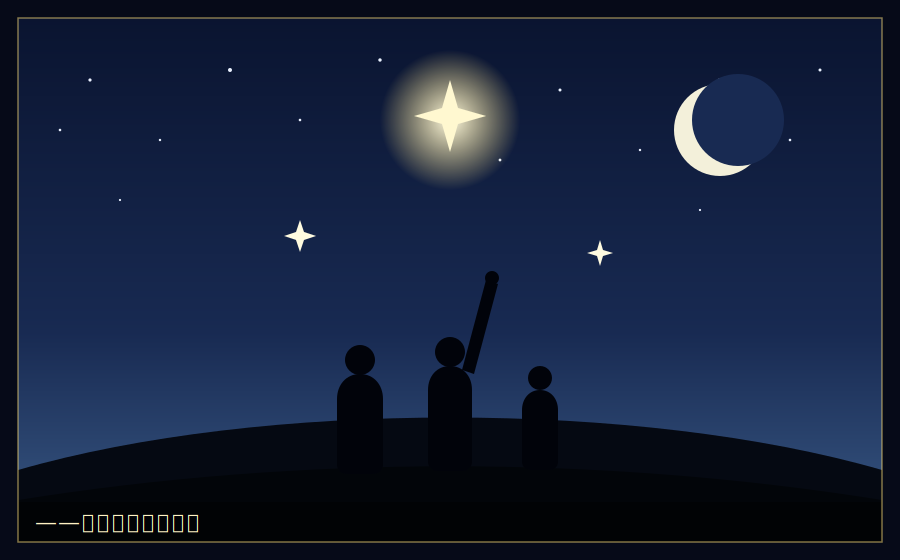

# 終章　灰よ、星を掴め

　半期末のクラス再編が、発表された。

　掲示板の前には、人だかりができていた。生徒たちが、自分の名前を、新しいクラスを、探していた。歓声と、ため息が、入り混じった。

　湊は、番場とひなと並んで、その掲示を見上げた。

　入学時、最下層のFクラス。初期資本、五百スター。二十倍の格差の底から、湊たちは始まった。

　そして今――。

『灰谷湊　旧Fクラス　→　新Bクラス』

「Bクラス……」番場が、掠れた声で言った。「F、E、D、C……四つ、飛び越えたのか。俺たち」

「二階級特進どころじゃないね。四階級特進」ひなが、笑った。目に、涙が滲んでいた。「Fクラスの掃きだめが、Bクラスだよ。信じられる?」

　湊は、その掲示を、静かに見つめていた。

　BクラスはまだSクラスではない。頂点には、遠い。白鷺令子は、まだ、はるか高みにいる。だが――灰の底から、四つの階層を、駆け上がった。それは、この学園の歴史でも、稀なことだった。

「まだ、途中だ」湊は言った。「頂点は、Sクラスだ。白鷺のいる場所だ。俺たちは、まだ、そこに立ってない」

「相変わらず、欲張りだねえ、ボスは」ひなが、肩をすくめた。

「当たり前だろ」湊は、笑った。「灰は、燃え残りだ。燃え尽きるまで、止まらない」

　　　　＊

　その夜、湊は、寮の自室で、一通の手紙を書いていた。

　母への手紙だった。スマホでメッセージを送れば早いのに、湊は、こういう報告だけは、手書きで書いた。父の店の、丸い字で書かれた値札を、思い出しながら。

　『母さんへ。

　俺は元気です。学校で、少しだけ、いい成績を取れました。Fクラスから、Bクラスに上がりました。友達も、できました。番場と、ひなっていう、いいやつらです。

　まだ、途中です。俺が知りたかった答え――なんで店が潰れるのか。その答えの、半分くらいは、分かった気がします。

　店が潰れるのは、味が悪いからじゃない。父さんの煮干しは、日本一うまかった。潰れたのは、生んだ価値を、守れなかったから。奪われたから。そして、誰も見ていない、新しい価値に、気づけなかったからです。

　父さんは、値段を大切にしすぎた、と白鷺っていう子に言われました。最初は、腹が立ちました。でも今は、少し分かります。父さんは、間違ってなかった。ただ、足りなかった。値段の優しさと、市場の厳しさ。その両方を、持てなかった。

　俺は、両方、持ちます。父さんの優しさと、この学園で学んだ厳しさ。その両方を持った経営者になります。そして、いつか――潰れない店の作り方を、誰かに、教えられる人間になります。田村のばあちゃんみたいな人が、安心して買い物できる場所を、作れる人間に。

　もう少し、待っててください。

　湊』

　湊は、手紙を封筒に入れ、糊で閉じた。

　窓の外には、星が出ていた。あの日、噴水の前で見た星と、同じ星。

　――星(スター)を掴む。

　この学園で、それは、金を稼ぐことを意味する。だが、湊にとっての「星」は、少し違った。

　潰れていく店の前で、下りきったシャッターを見上げた、あの日。灰色の鉄板が、夕日で、少しだけ赤く光った。あの光を、湊は、忘れない。

　灰の中にも、火はある。
　見捨てられたものにも、価値はある。
　持たざる者にも、生む力がある。

　それを証明し続けることが、灰谷湊の「星」だった。

　　　　＊

　翌朝。

　新Bクラスの教室に向かう廊下で、湊は、財前康介とすれ違った。

　財前は、総力戦の敗北で、Cクラスに留まっていた。以前の、勝ち誇った表情は、そこになかった。

　二人は、足を止めた。しばらく、無言で、向き合った。

「……なあ、灰谷」財前が、先に口を開いた。「一つ、聞いていいか」

「なんだ」

「お前、なんで、俺を、恨まないんだ」財前の声は、以前の余裕を失っていた。「俺は、お前を裏切った。全部、奪った。なのに、お前は、俺を見ても、憎しみの目をしない。……なんでだ」

　湊は、少し考えた。それから、言った。

「恨んでないわけじゃない。あの時は、本気で、お前を許せなかった」湊は言った。「でも、財前。お前は、俺に、大事なことを教えてくれた。生んだ価値は、守らなきゃ奪われる、ってことを。お前がいなきゃ、俺は、それを学ばずに、いつか、もっと大きく、全部を失ってたかもしれない。……授業料だと思ってる。高い授業料だったけどな」

　財前は、目を見開いた。

「それに」湊は、続けた。「お前は、奪う才能がある。人の心を読んで、動かす才能も。それは、本物だ。ただ、その才能を、奪うことにしか、使ってない。――もったいないと思う。お前が、その才能を、生むことに使ったら、俺なんか、すぐ抜かれる」

　財前は、しばらく、黙っていた。それから、廊下の窓の外を見て、ぽつりと言った。

「……うちの親父も、お前の親父と、似てたよ」

　湊は、顔を上げた。

「小さな家具工房をやってた。真面目で、腕は確かで、いい物を作る職人だった」財前の声から、いつもの軽さが消えていた。「でも、共同経営者に、全部持っていかれた。信じてた相手に、金も、設計図も、取引先も、根こそぎだ。親父は、抜け殻になった。……俺、その時、決めたんだ。生む側は、負ける。奪う側にならなきゃ、あの親父みたいになる、って」

「財前……」

「お前を裏切ったのも、それだよ」財前は、自嘲した。「お前らを見てて、怖かったんだ。真面目に、いい物を生んでるお前らが。……あの、潰れる前の、親父に、そっくりで。だから、潰れる前に、奪ってやろうと思った。俺は、奪う側だって、証明したくて」

　財前は、拳を、握った。

「でも、総力戦で、負けた。奪うだけの俺は、生み続けるお前に、勝てなかった。……皮肉だよな。奪う側になれば負けないと思ってたのに、いちばん負けたくなかった相手に、負けた」

　湊は、静かに言った。

「財前。お前の親父は、負けたんじゃない。奪われたんだ。それは、違う」

　財前が、顔を上げた。

「生む力があったから、奪う価値があった。奪われたのは、悔しい。俺も、同じ目に遭った。でもな――だからって、奪う側に回ったら、お前は、お前の親父が作ってたものを、この世から、一つ減らすことになる。いい家具を。いい物を。……それは、お前の親父を、二度、殺すことにならないか」

　財前の目が、揺れた。

　　　　＊

　財前は、しばらく、湊を見つめていた。

　やがて、彼は、俯いて、小さく、笑った。自嘲のような、それでいて、どこか、憑き物が落ちたような笑みだった。

「……お前、やっぱり、詩人だよ」

「言ってろ」

「灰谷」財前は、顔を上げた。「次は、俺も、生む側に回るかもしれない。その時は――正々堂々、やろうぜ」

　湊は、その言葉に、少しだけ驚いた。それから、頷いた。

「ああ。待ってる」

　財前は、背を向けて、去っていった。その背中は、少しだけ、軽くなったように見えた。

　――奪う者が、生む者に変わる。それもまた、一つの、再生かもしれない。

　湊は、そう思った。灰の中の火種は、財前の中にも、あったのかもしれない。

　　　　＊

　新Bクラスの教室のドアを開けると、番場とひなが、待っていた。

「遅いぞ、ボス!」番場が、手を振った。「新しい事業の話、始めてたところだ!」

「自治体の配食事業、順調だよ」ひなが、パソコンを掲げた。「次は、隣の市からも、引き合いが来てる。事業、広がってる。……灰谷くん、あたしたち、本当に、経営者になってきたね」

　湊は、二人を見て、笑った。

　この学園に来た日、湊は、たった一人だった。持ち物は、ボストンバッグ一つと、父の言葉が一つ。

　*値段の裏には、必ず誰かの都合がある。*

　あれから、半年。今、湊の隣には、仲間がいる。灰の中から拾い集めた、たくさんの手がある。父の店にはなかった、たくさんの手が。

「よし」湊は、教室の窓から、丘の上の空を見上げた。青い空に、昼の月が、白く浮かんでいた。

「次は、Aクラスだ。そして、Sクラス。白鷺のいる、頂点まで。――行くぞ」

「「おう!」」

　番場と、ひなの声が、重なった。

　灰谷湊の、成り上がりの物語は、まだ、始まったばかりだ。

　最下層(Fクラス)から、頂点(S)へ。
　灰の底から、星(スター)へ。

　燃え残った灰は、風に散らず、火種を抱いて、また燃える。

　――灰よ、星を掴め。

　その火が、この学園を、そして、いつか、外の世界を、照らすその日まで。

　　　　＊

　＜第一巻・完＞

　　　　＊

　――次巻予告――

　Bクラスに昇格したチーム・アッシュを待っていたのは、新たな試練だった。

　学園に、突如現れた謎の転入生。Sクラスに、外部から引き抜かれてきた、企業経営の実戦経験を持つ「本物」。

　そして、頂点・白鷺令子の背後に見え隠れする、白鷺グループの、巨大な思惑。

　かつての王者・黒崎遼が、再び動き出す。

　灰谷湊は、より大きな盤面で、より大きな価値の創造を、問われることになる。

　――なぜ、会社は、大きくなると、腐るのか。

　新たな問いを胸に、湊の戦いは、続く。

　『灰からはじめる経営学園』第二巻、いつか、あなたのもとへ。
