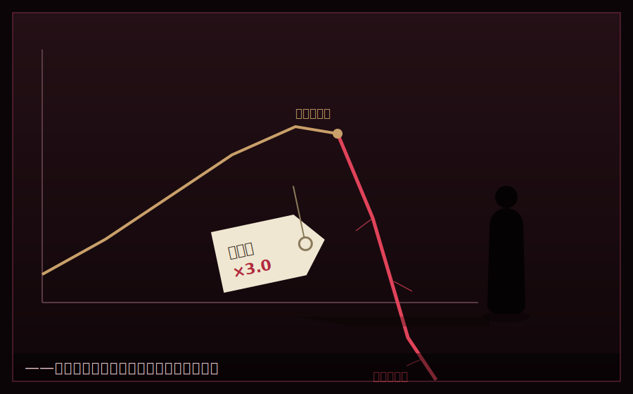

# 第四章　裏切りの値札

　二学期の、中盤。ある朝、柏木は、教室に入るなり、黒板に、太い字で書いた。

『アライアンス・ウォーズ ―― 開戦』

「さあ、この学園で、いちばん血なまぐさいイベントだ」柏木は、いつもの眠そうな顔のまま、しかし、めずらしく声を低くした。「ルールを説明する。心して、聞け」

　柏木が語ったルールは、これまでとまるで違っていた。

　各カンパニーは、他のカンパニーの『株式』を、スターで買い集めることができる。株式の過半数を握れば、そのカンパニーを**買収**できる。買収されたチームは、資産も事業も、丸ごと、買収した側に吸収される。

　つまり――今まで築いてきたものを、根こそぎ奪い合う戦いだった。

　教室が、ざわめきに包まれた。柏木は、その空気が静まるのを待って、最後に、一つだけ、付け加えた。

「忠告しておく。……このゲームで、いちばん高くお前を売るのは、赤の他人じゃない。お前が『味方だ』と信じた奴だ。株を預けるってのは、心臓を預けるのと、同じことだ。誰に預けるか――そこだけは、間違えるなよ」

　湊は、その言葉を、確かに聞いていた。聞いて――そして、忘れた。財前と築いた同盟の、心地よさの中で、その忠告は、するりと、こぼれ落ちた。

　――後になって、湊は、何度も、この朝を思い出すことになる。柏木は、確かに、警告してくれていた。なのに、俺は、聞き流した、と。

　　　　＊

「えげつない制度だな……」番場が、青ざめた。「今までの努力、全部、取られるかもしれないってことか」

「逆に言えば、弱いチームを吸収して、一気に大きくなれる」湊は、資料を睨んでいた。「M&Aだ。現実の経営でも、会社は買われ、売られる。ここは、その予行演習だ」

　湊たちのチーム・アッシュは、この時点で有力な買収の標的だった。資産一万スター超、効率のいい事業、確立されたネットワーク。だが同時に、狙う側にもなれる立場だった。

「作戦は?」ひなが聞いた。

「守りを固めつつ、隙のある弱小チームを一つ、買収して規模を広げる」湊は言った。「うちの株を、外に流出させない。自社株は、俺たち四人で固く握っておく。財前とも、株の相互保有で守りを固めよう。同盟だからな」

　その言葉に、財前は、いつもの爽やかな笑顔で頷いた。

「もちろん。俺たちは運命共同体だ。株を持ち合って、外敵から守り合おう」

　その日、湊と財前は、互いのチームの株式を持ち合う契約を結んだ。湊は、自分たちの株の三割を、信頼の証として、財前のチームに預けた。財前も同様に、自分の株を湊に預ける――はずだった。

　――はずだった。

　　　　＊

　異変が起きたのは、買収戦が始まって三日目の朝だった。

　ひなが、真っ青な顔で教室に駆け込んできた。

「灰谷! 大変! うちの株が――うちの株の過半数が、Sクラスの白鷺のチームに、買い占められてる!」

「なんだと?」

　湊は、株主名簿を確認した。血の気が引いた。

　チーム・アッシュの発行株のうち、五割を超える分が、白鷺令子のカンパニーの名義になっていた。過半数。つまり――買収成立の一歩手前。

「そんなはずない! 俺たちの株は、四人で握ってたはずだ! 外に売った覚えは――」

　そこまで言って、湊は、凍りついた。

　――財前に、預けた三割。

「……財前は」湊は、掠れた声で言った。「財前は、どこだ」

　ひなが、震える指で、一枚の書類を差し出した。

「灰谷……財前くんの名義のうちの株が、全部……白鷺のチームに、売られてる。売却価格、通常の相場の、三倍。……財前くんは、あたしたちの株を、白鷺に売り渡したの」

　教室の空気が、凍った。

　番場が、机を殴った。「嘘だろ! 財前が、そんなこと……!」

　その時、教室のドアが開いた。

　財前康介が、立っていた。いつもの爽やかな笑顔で。だが、その目は、今までとまるで違う色をしていた。冷たく、勝ち誇り、そして――少しの憐れみを浮かべて。

「よう、灰谷」

「財前……お前、何をした」

　財前は、ゆっくりと教室に入ってきた。

「何をした、って。ビジネスをしただけだよ」財前は、肩をすくめた。「俺は、お前らから預かった株を、いちばん高く買ってくれる相手に売った。白鷺の令嬢は、お前らを潰すために、相場の三倍で買ってくれた。俺は、それを断る理由がなかった。――安く仕入れて、高く売る。商売の基本だろ? 灰谷、お前が言ったんだぜ」

　湊の頭の中で、いくつもの記憶が、繋がっていった。

　共有フォルダから消えた仕入れデータ。「仕入れは俺が管理する」という言葉。株の相互保有という名の――一方的な株の預かり。

　――こいつは、最初から。最初から、これが目的だった。

「お前……最初から、俺たちに近づいたのは」

「そうだよ」財前は、あっさりと認めた。「お前らのネットワークは、金になる。だが、お前らはFクラス上がりの貧乏人だ。いずれ潰れる側だ。だったら、いちばん高いうちに、丸ごと現金化するのが賢い。――俺は、お前らという『会社』を、白鷺に売ったんだ。株ごとな」

「規格外野菜がもったいないって……食い物を粗末にするのが嫌いって……あれは」

「ああ、あれ?」財前は、けらけらと笑った。「お前が『なんでこの事業をやってる』って聞いてきた時、お前が何を言われたら心を開くか、顔に書いてあったからな。『持たざる者同士』ってやつ。ぐっときてただろ? 演技だよ、全部。……人を動かすには、相手の物語に合わせてやるのが、いちばん早い」

　湊は、拳を握りしめた。爪が、掌に食い込んだ。

　――値段の裏には、都合がある。

　父の言葉が、今、この上なく苦く響いた。財前の温かかった手の裏に、こんな都合が隠れていた。湊は、それを見抜けなかった。信じたかった。仲間が欲しかった。その弱さを、この男は、正確に突いてきた。

「灰谷」財前は、去り際、湊の耳元で囁いた。

「お前は、詩人なんだよ。値段には都合があるとか、価値を生むとか、きれいごとを並べる。でもな、経営ってのは、奪い合いだ。奪える奴が勝つ。奪われる奴が負ける。――お前は、負けた。それだけの話だ」

　財前は、教室を出ていった。

　残されたのは、崩れ落ちるように座り込んだ番場と、パソコンを抱えて震えるひなと――そして、立ち尽くす湊だった。

　　　　＊

　その日の午後、正式に通告が来た。

　チーム・アッシュは、白鷺令子のカンパニーによって、買収された。過半数の株式を握られた以上、経営権は令子の手に落ちた。

　湊たちが一から築いた仲介ネットワークも、事業も、一万スターを超える資産も――すべて、白鷺グループのカンパニーに吸収された。

　そして令子は、吸収したチーム・アッシュの事業を、無慈悲に「整理」した。効率の悪い部分は切り捨て、利益の出る部分だけを本体に組み込んだ。番場が築いた飲食店との信頼関係も、ひなが組んだシステムも、令子にとっては「買った資産の一部」でしかなかった。

　残されたのは、負債だった。

　買収戦の中で、湊は防衛のために追加の株を買い戻そうとして、スターを使い込んでいた。だが、買収は成立し、買い戻しは無駄になった。手元に残ったのは、ほぼ空になったスター残高と――マイナスの帳簿。

　チーム・アッシュは、事実上、解体された。

　　　　＊

　その夜。

　湊は、一人で中庭の噴水の縁に座っていた。あの日、令子と初めて言葉を交わした場所。

　星が、出ていた。皮肉なことに、きれいな夜だった。

「……ざまあないな」湊は、自分に呟いた。

　膝の上には、ひなが作ってくれた収支表があった。あんなに順調に伸びていたグラフが、崖から落ちるように、ゼロを割り込んでいた。

　――親父。俺、また、見た。

　店が潰れる瞬間を。今度は、他人事じゃなかった。自分の手で築いたものが、崩れていくのを、間近で見た。

　あの時、湊は思っていた。金がなくても、価値は生めると。物がなくても、商売はできると。それは、間違いじゃなかった。

　だが、忘れていたことがあった。

　――価値を生む者の隣には、いつだって、それを奪おうとする者がいる。

　父の店を潰したのも、そうだった。大型スーパーは、父が丁寧に築いた「近所の信頼」という価値を、安さと便利さで根こそぎ奪っていった。財前も、同じだ。湊が築いた価値を、掠め取っていった。

　価値を生むだけでは、足りない。生んだ価値を、守れなければ。奪おうとする者から、勝ち切れなければ。

「……甘かった」

　湊は、拳で、自分の膝を叩いた。

　涙は、出なかった。出そうになって、歯を食いしばって、呑み込んだ。ここで泣いたら、本当に、灰になる。燃え尽きて、終わりだ。

「灰谷」

　声がした。振り向くと、番場とひなが立っていた。二人とも、目を赤くしていた。

「……お前ら」

「探したぞ、こんなとこにいたのかよ」番場が、洟をすすった。「なあ、灰谷。俺、悔しいよ。財前のこと、いい奴だって、俺が言ったから……俺が、信じたから……」

「番場のせいじゃない」湊は言った。「俺が、契約の穴を見抜けなかった。株を預けたのは、俺の判断だ。……俺の、負けだ」

「あたしも、悔しい」ひなが、洟をすすった。「でも……もっと悔しいのは、このまま終わりかって思うことだよ。あたしたち、あんなに、いいチームだったのに」

　三人は、しばらく、黙って星を見ていた。

　やがて、湊が、口を開いた。

「……番場。ひな。一つだけ、聞かせてくれ」

「なんだよ」

「もう一度、やる気は、あるか」

　二人が、顔を上げた。

「俺たちは、全部奪われた。金も、事業も、ネットワークも。だが――」湊は、自分の頭を指さした。「これは、奪われてない。俺たちが、何をどう作ったか。どうやって無から有を生んだか。その『やり方』は、財前にも、白鷺にも、奪えない。俺たちの中に、残ってる」

　湊は、立ち上がった。星明かりの下で。

「もう一度、ゼロから作る。今度は、奪われない作り方で。奪おうとする奴に、勝ち切れる作り方で。――付き合ってくれるか」

　番場が、涙をぬぐって、にっと笑った。

「当たり前だろ。俺は、最初にお前に言ったんだ。『お前、いいな』って。あれ、今でも思ってるぜ」

　ひなが、パソコンを、ぱんと叩いた。

「言ったでしょ。あたし、あんたをボスに選んだの。ボスが立つなら、あたしも立つ。――データは、あたしの頭の中に全部ある。ゼロからでも、すぐ動ける」

　湊は、二人を見て、初めて、少しだけ笑った。

　奪われても、残るものがある。それが、仲間だった。財前が「演技」で作った偽物の絆とは、まるで違う、本物が。

　――待ってろ、財前。白鷺。

　灰の底で、火種が、また、赤く灯った。

　*灰は、燃え残りだ。まだ、燃える。*
