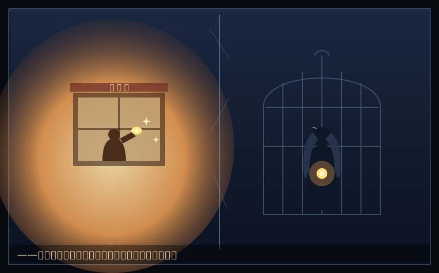

# 幕間　硝子(ガラス)の檻(かご)

　総力戦の、前夜。

　白鷺令子(しらさぎ れいこ)は、眠れずにいた。

　Sクラスの個室寮は、広い。天蓋つきのベッド、大理石の洗面台、専属の清掃係。Fクラスの相部屋の、何倍もの空間。誰もが羨む、女王の部屋。

　窓の外に、丘の下の安寮の灯りが見えた。あの、狭くて、うるさくて、隙間風の入る寮。灰谷湊たちの、いる場所。

　令子は、その小さな灯りを、じっと見ていた。

　なぜだろう。あの貧しい灯りのほうが、この広すぎる部屋より、ずっと――温かそうに見えるのは。

　　　　＊

　令子には、たった一つだけ、数字にならない場所があった。

　港町の、細い路地の奥。祖母・白鷺澄江(すみえ)が営む、小さな洋菓子店「スミレ」。

　間口の狭い、古い店だった。ショーケースには、不揃いなマドレーヌと、少し焦げたフィナンシェ。祖母は、常連の名前を、一人残らず覚えていた。「田中さんは、甘さ控えめがお好きね」「山本さんとこの坊やは、今日も元気?」

　幼い令子は、その店が、世界でいちばん好きだった。

　バターと、焦げた砂糖の匂い。オーブンの熱。祖母は、店に来た令子に、いつも焼きたてのマドレーヌを、そっと握らせてくれた。「令ちゃん。おいしいものはね、人を、しあわせにするのよ」

　そこだけが、令子にとって、「値段」でも「収支」でもない場所だった。白鷺の家では、すべてが数字だった。テストの点。ピアノのコンクールの順位。跡取りとしての、価値。父に褒められるのは、いつも、「結果」だけ。

　でも、スミレでは、違った。祖母は、令子が令子であるというだけで、笑ってくれた。

　　　　＊

　スミレが畳まれたのは、令子が八つの年だった。

　白鷺グループの、大規模な事業整理。祖母の店は、万年赤字だった。当主である父――白鷺征一郎(せいいちろう)は、それを、感傷なく、切り捨てた。

　祖母は、生まれて初めて、息子に頭を下げた。「征一郎。あの店だけは、残しておくれ。あそこには、わたしの、お客さんがいるんだよ」

　父は、答えなかった。ただ、泣きじゃくる令子に、こう言った。

「令子。感傷は、赤字の言い訳にはならない。あの店は、数字として、もう死んでいる。私情で生かせば、いずれ、周りの健全な事業まで道連れにする。――お前が跡を継ぐなら、覚えておきなさい。愛したものを切れる者だけが、多くを守れる」

　スミレは、閉じた。

　祖母は、それから、目に見えて小さくなっていった。まるで、あの店と一緒に、火が消えていくように。令子が十の年、祖母は、静かに亡くなった。

　最後に、令子の手を握って、こう言った。

「令ちゃんは……好きなものを、好きと、言える子で、いなさいね」

　だが、令子には、もう、言えなかった。

　好きだと口にしたものは、父に「非効率」と切り捨てられる。愛したものは、失う。だったら――最初から、愛さなければいい。数えるだけでいい。心を動かさなければ、心は、傷つかない。

　こうして、白鷺令子は、完璧な後継者になった。首席。氷の女王。誰からも羨まれ、そして――何一つ、愛せない少女に。

　　　　＊

　硝子の檻だ、と令子は思う。

　この広い部屋も、Sクラスの椅子も、白鷺の名も。全部、美しい硝子でできた、檻。中の鳥は、羽ばたく必要がない。餌も、安全も、すべて与えられる。ただ一つ、与えられないものがある。

　――外の、風。

　　　　＊

　買収戦で、令子は、チーム・アッシュを「整理」した。

　番場剛が築いた、飲食店との泥くさい信頼。桃園ひなが、寝ずに組み上げた、不格好だが温かい仕組み。効率だけで見れば、無駄の多い、感傷的な資産たち。令子は、それを、一つずつ、冷徹に切り刻んだ。

　切りながら――令子は、吐き気がしていた。

　これは、あの日と同じだ。スミレを畳んだ、あの日と。愛や、信頼や、人の温もりでできた場所を、数字の名のもとに、この手で殺していく作業。父が、祖母にしたことを、今、自分が、あの貧しい少年たちに、している。

　「正しい」経営判断のはずだった。なのに、その夜も、令子は、眠れなかった。

　そして――切り捨てたはずの灰の中から、湊たちは、もう一度、火を起こした。

　愛したもので、勝とうとしている。令子が、一生をかけて「不可能だ」と諦めた道で。数字にならないものを、握って、離さないで。父が「道連れになる」と切り捨てた、その感傷を、武器にして。

　令子は、気づいてしまった。

　自分が総力戦で選んだ商材が、なぜ、高級輸入菓子だったのか。無意識のうちに、彼女は、追っていたのだ。あの、狭い路地の奥の、バターと焦げた砂糖の、匂いを。祖母の、スミレの、面影を。

　――憎らしい。あの貧乏人が。
　――羨ましい。好きなものを、好きだと、言い続けられる、あの強さが。
　――そして、眩しい。どうしようもなく。

　令子は、窓の下の、小さな灯りを見つめた。

　もし、明日、負けたら。
　もし、あの男に、負けたら。

　一つだけ、聞いてみよう、と令子は思った。ずっと、檻の中から、聞きたかったことを。

　――どうして、あなたは。好きなものを、好きだと、言い続けられるの。

　窓ガラスに、令子の顔が、うっすらと映っていた。

　その頬に、いつのまにか、一筋、伝っているものがあった。八つの年に、スミレの前で流したきり、涸らしていたはずのものが。

　――おばあちゃん。わたし、まだ、言えないよ。

　その夜、氷の女王は、誰も見ていない檻の中で、一人、静かに泣いた。

　翌朝の、敗北を、まだ知らずに。
